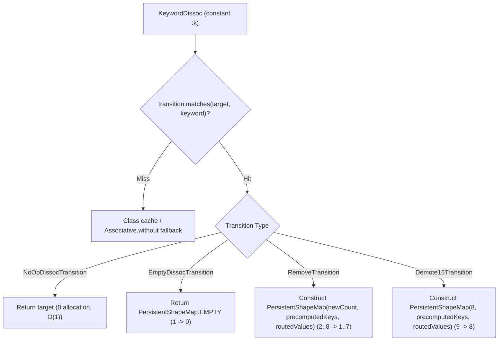

# Plan: KeywordDissoc Transition Cache & Demotion

## Overview

This plan provides comprehensive instructions and architectural hints for implementing a transition cache on `KeywordDissoc` (in `src/jvm/net/javacrumbs/cloffle/bytecode/CloffleBytecodeRootNode.java` and `src/jvm/clojure/lang/PersistentShapeMap.java` / `PersistentShapeMap16.java`), mirroring the success of `AssocTransition` for `KeywordAssoc`.

The goal is to eliminate key shuffling, bitmask arithmetic, and multi-case branching during compiled `(dissoc m :k)` operations, enabling full Partial Escape Analysis (PEA) / scalar replacement (0 B/op) for sanitization pipelines (e.g. `(-> m (dissoc :secret) (dissoc :temp))`).

---

## 1. Architectural Motivation

Currently, `KeywordDissoc` in `CloffleBytecodeRootNode.java` delegates through a class cache:
```java
@Specialization(guards = "target.getClass() == cachedClass", limit = "8")
public static Object doMapCached(Keyword keyword, IPersistentMap target, ...) {
    return CompilerDirectives.castExact(target, cachedClass).without(keyword);
}
```
When called on a `PersistentShapeMap`, `without(kw)` must:
1. Inspect 128-bit bitmasks (`mask0 & kw.mask0`, `POPCNT`) or linear scan `hasHighKeys`.
2. Compute cleared masks: `mask0 & ~kw.mask0`, `mask1 & ~kw.mask1`.
3. Compute `newHasHighKeys` by looking at the remaining highest key.
4. Execute an 8-case switch to left-shift both keys and values (`nk0..nk6`, `nv0..nv6`).
5. Allocate a new `PersistentShapeMap` with 17 arguments.

When multiple `dissoc` calls are chained, this control flow bloats GraalVM's inlining budget and inhibits PEA.

With a **`DissocTransition` cache** at the bytecode level:
- Key presence and slot index (0..count-1) are resolved at specialization time.
- Destination keys (`toK0..toK6`) and destination masks are precomputed and stored on the `DissocTransition` instance (treated as compilation-final constants by GraalVM).
- At runtime, GraalVM only needs to emit direct scalar moves of the remaining values into the new `PersistentShapeMap` constructor (or return the exact same instance on a no-op, or return `EMPTY` on 1->0).



---

## 2. Component Design & Implementation Steps

### Step 2.1: Implement `DissocTransition` in `PersistentShapeMap.java`

Location: `src/jvm/clojure/lang/PersistentShapeMap.java` (alongside `AssocTransition`).

#### 1. Base Class: `DissocTransition`
```java
public abstract static class DissocTransition {
    public final Keyword keyword;
    public final int count;
    public final Keyword k0, k1, k2, k3, k4, k5, k6, k7;
    public final long mask0;
    public final long mask1;
    public final boolean hasHighKeys;

    protected DissocTransition(PersistentShapeMap map, Keyword keyword) {
        this.keyword = keyword;
        this.count = map.count;
        this.k0 = map.k0;
        this.k1 = map.k1;
        this.k2 = map.k2;
        this.k3 = map.k3;
        this.k4 = map.k4;
        this.k5 = map.k5;
        this.k6 = map.k6;
        this.k7 = map.k7;
        this.mask0 = map.mask0;
        this.mask1 = map.mask1;
        this.hasHighKeys = map.hasHighKeys;
    }

    public final boolean matches(PersistentShapeMap map, Keyword keyword) {
        return this.keyword == keyword
                && map.count == count
                && (count < 1 || map.k0 == k0)
                && (count < 2 || map.k1 == k1)
                && (count < 3 || map.k2 == k2)
                && (count < 4 || map.k3 == k3)
                && (count < 5 || map.k4 == k4)
                && (count < 6 || map.k5 == k5)
                && (count < 7 || map.k6 == k6)
                && (count < 8 || map.k7 == k7);
    }

    public abstract IPersistentMap apply(PersistentShapeMap map);
}
```

#### 2. Subclass: `NoOpDissocTransition`
Used when `keyword` is not present in `map`:
```java
private static final class NoOpDissocTransition extends DissocTransition {
    private NoOpDissocTransition(PersistentShapeMap map, Keyword keyword) {
        super(map, keyword);
    }

    @Override
    public IPersistentMap apply(PersistentShapeMap map) {
        return map;
    }
}
```

#### 3. Subclass: `EmptyDissocTransition`
Used when `count == 1` and `k0 == keyword`:
```java
private static final class EmptyDissocTransition extends DissocTransition {
    private EmptyDissocTransition(PersistentShapeMap map, Keyword keyword) {
        super(map, keyword);
    }

    @Override
    public IPersistentMap apply(PersistentShapeMap map) {
        return (IPersistentMap) PersistentShapeMap.EMPTY.withMeta(map.meta());
    }
}
```

#### 4. Subclass: `RemoveTransition`
Used when `count >= 2` and `keyword` is present at `slot` (0 <= slot < count):
```java
private static final class RemoveTransition extends DissocTransition {
    private final byte slot;
    private final long newMask0;
    private final long newMask1;
    private final boolean newHasHighKeys;
    // Precomputed destination keys (null beyond count - 1)
    private final Keyword toK0, toK1, toK2, toK3, toK4, toK5, toK6;

    private RemoveTransition(PersistentShapeMap map, Keyword keyword, int slot) {
        super(map, keyword);
        this.slot = (byte) slot;
        this.newMask0 = mask0 & ~keyword.mask0;
        this.newMask1 = mask1 & ~keyword.mask1;
        // Remaining highest key determines hasHighKeys
        int lastRemainingIdx = (slot == count - 1) ? count - 2 : count - 1;
        this.newHasHighKeys = hasHighKeys && map.getKey(lastRemainingIdx).id >= 128;

        // Precompute destination keys without runtime shifting
        Keyword[] dest = new Keyword[7];
        int d = 0;
        for (int i = 0; i < count; i++) {
            if (i != slot) {
                dest[d++] = map.getKey(i);
            }
        }
        this.toK0 = dest[0];
        this.toK1 = dest[1];
        this.toK2 = dest[2];
        this.toK3 = dest[3];
        this.toK4 = dest[4];
        this.toK5 = dest[5];
        this.toK6 = dest[6];
    }

    @Override
    public PersistentShapeMap apply(PersistentShapeMap map) {
        int newCount = count - 1;
        return switch (slot) {
            case 0 -> new PersistentShapeMap(map.meta(), newCount, newMask0, newMask1, newHasHighKeys,
                    toK0, map.v1, toK1, map.v2, toK2, map.v3, toK3, map.v4, toK4, map.v5, toK5, map.v6, toK6, map.v7, null, null);
            case 1 -> new PersistentShapeMap(map.meta(), newCount, newMask0, newMask1, newHasHighKeys,
                    toK0, map.v0, toK1, map.v2, toK2, map.v3, toK3, map.v4, toK4, map.v5, toK5, map.v6, toK6, map.v7, null, null);
            case 2 -> new PersistentShapeMap(map.meta(), newCount, newMask0, newMask1, newHasHighKeys,
                    toK0, map.v0, toK1, map.v1, toK2, map.v3, toK3, map.v4, toK4, map.v5, toK5, map.v6, toK6, map.v7, null, null);
            case 3 -> new PersistentShapeMap(map.meta(), newCount, newMask0, newMask1, newHasHighKeys,
                    toK0, map.v0, toK1, map.v1, toK2, map.v2, toK3, map.v4, toK4, map.v5, toK5, map.v6, toK6, map.v7, null, null);
            case 4 -> new PersistentShapeMap(map.meta(), newCount, newMask0, newMask1, newHasHighKeys,
                    toK0, map.v0, toK1, map.v1, toK2, map.v2, toK3, map.v3, toK4, map.v5, toK5, map.v6, toK6, map.v7, null, null);
            case 5 -> new PersistentShapeMap(map.meta(), newCount, newMask0, newMask1, newHasHighKeys,
                    toK0, map.v0, toK1, map.v1, toK2, map.v2, toK3, map.v3, toK4, map.v4, toK5, map.v6, toK6, map.v7, null, null);
            case 6 -> new PersistentShapeMap(map.meta(), newCount, newMask0, newMask1, newHasHighKeys,
                    toK0, map.v0, toK1, map.v1, toK2, map.v2, toK3, map.v3, toK4, map.v4, toK5, map.v5, toK6, map.v7, null, null);
            case 7 -> new PersistentShapeMap(map.meta(), newCount, newMask0, newMask1, newHasHighKeys,
                    toK0, map.v0, toK1, map.v1, toK2, map.v2, toK3, map.v3, toK4, map.v4, toK5, map.v5, toK6, map.v6, null, null);
            default -> throw new AssertionError("Invalid slot: " + slot);
        };
    }
}
```

#### 5. Factory Method: `dissocTransition`
```java
public static DissocTransition dissocTransition(PersistentShapeMap map, Keyword keyword) {
    if (map.count == 0) {
        return new NoOpDissocTransition(map, keyword);
    }
    int slot = map.indexOfKey(keyword);
    if (slot < 0) {
        return new NoOpDissocTransition(map, keyword);
    }
    if (map.count == 1) {
        return new EmptyDissocTransition(map, keyword);
    }
    return new RemoveTransition(map, keyword, slot);
}
```

---

### Step 2.2: Add ShapeMap16 $9 \to 8$ Demotion (Optional / Phase 2)

When `target` is `PersistentShapeMap16` and `target.count == 9`:
- Removing an existing key demotes directly to `PersistentShapeMap(8)`.
- Can be implemented via `Shape16DissocTransition`:
  - `matches(PersistentShapeMap16 map, Keyword keyword)`
  - Precomputes 8 destination keys `toK0..toK7` and bitmasks.
  - Switches on `slot` (0..8) and returns `new PersistentShapeMap(map.meta(), 8, newMask0, newMask1, newHasHighKeys, toK0, v..., ..., toK7, v...)`.
- Wire into `KeywordDissoc` with specialization on `PersistentShapeMap16 target`.

---

### Step 2.3: Wire Transition into `CloffleBytecodeRootNode.java`

Location: `src/jvm/net/javacrumbs/cloffle/bytecode/CloffleBytecodeRootNode.java` in `KeywordDissoc`.

```java
@Specialization(guards = "transition.matches(target, keyword)", limit = "4")
public static Object doShapeMapTransition(
        Keyword keyword,
        PersistentShapeMap target,
        @com.oracle.truffle.api.dsl.Cached("createTransition(target, keyword)")
        PersistentShapeMap.DissocTransition transition) {
    return transition.apply(target);
}

@Specialization(guards = "target.getClass() == cachedClass", limit = "8")
public static Object doMapCached(...) {
    return CompilerDirectives.castExact(target, cachedClass).without(keyword);
}

protected static PersistentShapeMap.DissocTransition createTransition(
        PersistentShapeMap target, Keyword keyword) {
    return PersistentShapeMap.dissocTransition(target, keyword);
}
```

Note: Place `doShapeMapTransition` before `doMapCached` so Truffle DSL checks the transition cache first when given a `PersistentShapeMap`.

---

## 3. Hints & Gotchas for the Implementation Agent

1. **Keep Host `without(kw)` Untouched**:
   - `PersistentShapeMap.without(Object key)` is called from host Java code and fallback paths. Leave its internal logic and signature intact.
   - The transition classes are solely invoked via `KeywordDissoc.doShapeMapTransition` in bytecode.
2. **`PersistentShapeMap` Constructors**:
   - Note the 17-argument constructor:
     `new PersistentShapeMap(IPersistentMap meta, int count, long mask0, long mask1, boolean hasHighKeys, Keyword k0, Object v0, ..., Keyword k7, Object v7)`.
   - When constructing with `count < 8`, unused trailing `k` and `v` slots must be passed as `null`.
3. **`meta()` Preservation**:
   - Always pass `map.meta()` when constructing the result or wrapping `EMPTY.withMeta(map.meta())`.
4. **Keyword Matching**:
   - Interned `Keyword` references can be compared with `==`.
   - In `matches`, check `this.keyword == keyword` and `map.count == count` first, followed by each active key slot (`count < i || map.ki == ki`).

---

## 4. Verification and Benchmark Strategy

### Unit Tests
1. **`PersistentShapeMapTest.java`**:
   - Add `testCachedDissocTransitions()`:
     - Verify no-op on empty map.
     - Verify no-op when key is absent from maps of sizes 1..8.
     - Verify empty map returned when removing the sole key from size 1.
     - Verify correct key order and value mapping when removing slot 0, middle slots, and last slot for maps of sizes 2..8.
     - Verify `matches` returns `false` when map keys or counts change.
2. **`GuestCompilationUnitTest.java`**:
   - Add `testCachedShapeMapDissocInGuestCode()`:
     - Compile guest function: `(fn [m] (dissoc m :b))`.
     - Execute with warm-up; check `inCompiledCode`.
     - Test multi-dissoc pipeline: `(fn [m] (-> m (dissoc :c) (dissoc :a)))`.

### Partial Escape Analysis (PEA)
1. **`KeywordMapBenchmark.java`**:
   - Add JMH benchmark:
     ```java
     @Benchmark
     public Object guestShapeMapEphemeralDissoc() {
         return guestEphemeralDissocFn.execute(TARGET_MAP);
     }
     ```
   - Pipeline benchmark:
     ```java
     @Benchmark
     public Object guestEventSanitizePipeline() {
         return guestSanitizePipelineFn.execute(EVENT_MAP);
     }
     ```
2. **`build.clj`**:
   - Register the new benchmark in `guest-compilation-hints` so `clojure -T:build check-scalar-replacement` inspects the Graal IR.
3. **Run Commands**:
   - Always run with environment variables set:
     ```sh
     export ENV=local && eval "$(direnv export zsh)"
     clojure -T:build run-tests
     clojure -T:build check-scalar-replacement :benchmark ".*Dissoc.*"
     ```
4. **Git Commits**:
   - Per project rules, always use signed commits: `git commit -s`.
