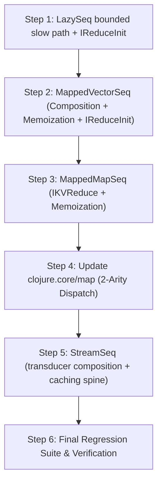

# Cloffle Unified Lazy Pipeline & Map Optimization Plan

## 1. Executive Summary & Objective

In Clojure, sequence processing functions—including `map`, `filter`, `concat`, `take`, `take-while`, `drop`, `drop-while`, `partition`, `interleave`, `take-nth`, `repeatedly`, `for`, `lazy-cat`, `tree-seq`, `re-seq`, `line-seq`, and `pmap`—are fundamentally tied to `clojure.lang.LazySeq` and `clojure.lang.Cons`.

In Cloffle (Clojure on GraalVM Truffle), this architecture suffers from four systemic performance bottlenecks:
1. **`LazySeq.realize()` is fully partially-evaluated into the guest compilation unit**, so its cold slow path (thunk invocation, nested-chain trampoline, exception handling) consumes the Truffle inlining budget of every caller that touches a sequence.
2. **Anonymous thunk closures** (`fn* [] ...`) allocate Truffle closure objects and capture execution frames on every step.
3. **The recursive linked-list spine** (`cons` + `lazy-seq`) creates $O(N)$ heap allocations for $N$ elements.
4. **`LazySeq` does not implement `IReduceInit`**, forcing eager consumers (`into`, `reduce`, `vec`, JSON encoders) to traverse the spine element-by-element through dynamic method dispatch.

> **Correction (supersedes the original bottleneck #1).** Earlier revisions of this plan asserted that "the Java `synchronized` monitor barrier in `LazySeq.java` defeats PEA and inlining." That was wrong; see [§3](#3-architecture-phase-1-lazyseq-correctness--reduction-acceleration) for the full analysis. The monitor was never in the hot path, and removing it produced a spin-lock regression. The real cost was, and remains, slow-path bloat inside the partial-evaluation unit.

Furthermore, in real-world Clojure code, collections are **predominantly vectors (`[]`) and maps (`{}`), frequently nested and chained in pipelines** like `(->> v (map f) (filter p) (map g))`.

This plan outlines a **unified, multi-phase architecture** to replace recursive `lazy-seq` evaluation with composable, zero-allocation sequence views, accelerating the entire family of sequence functions while **strictly maintaining 100% of Clojure's public semantics and language contracts**.

The throughput comes from **not constructing `LazySeq` nodes at all** (Phases 2–3), not from making `LazySeq` itself cheaper. A `LazySeq` that genuinely realizes inside a compilation unit cannot be scalar-replaced under any locking scheme (§3A.6), so Phase 1 is scoped as a correctness and inlining-budget fix. Compiler AST fusion (`ExprToBytecodeFusion`) is out of scope here; see [TODO.md](TODO.md).

**Every single change in this plan includes mandatory Unit Tests and Scalar-Replacement (:guest true) Graal IR verification tests.**

---

## 2. Clojure's Official Definition of Laziness & Public Semantic Invariants

To maintain Clojure's public semantics, any optimization or replacement for `LazySeq` must strictly adhere to Clojure's formal language invariants:

### A. Deferred, Demand-Driven Execution
- Sequence construction must be $O(1)$ and **must not evaluate `f`** at definition time.
- Side effects in `f` must not execute until elements are demanded by consumer calls (`first`, `next`, `reduce`).
- Infinite sequences (e.g. `(map inc (range))` or `(take 5 (repeatedly rand))`) must remain safe and must never hang or exhaust memory during sequence construction.

### B. Memoization / Caching (The Head Retention Invariant)
- **A Clojure `ISeq` is a persistent, immutable data structure, NOT a one-shot cursor or stream.**
- If user code holds a reference to the head:
  ```clojure
  (def s (map (fn [x] (println "eval" x) (inc x)) [1 2 3]))
  (first s) ; prints "eval 1", returns 2
  (first s) ; MUST NOT print "eval 1" again! Returns cached 2.
  ```
- Once an element is computed, **it must be cached in the sequence node**. Multiple calls to `first` or re-traversing the sequence must never re-evaluate `f`.
- Stepping through `next()` must also cache the next sequence node so structural sharing is preserved.

### C. The Pending Protocol (`clojure.lang.IPending`)
- Clojure provides `(realized? s)` via the `clojure.lang.IPending` interface.
- A lazy sequence must report `(realized? s) => false` before its value is evaluated, and `true` once realized.

### D. Note on 32-Element Chunking
- Clojure 1.1 introduced 32-element chunking (`IChunkedSeq`) as an internal JVM optimization.
- Rich Hickey clarified that chunking is an **implementation detail**, not a language specification requirement.
- Stepping strictly 1-by-1 on demand is actually more purely lazy than chunking and is 100% compliant with Clojure's language specification.

### E. Sequential Contract (`ISeq`) & Map Entry Contract
- Return values must satisfy `(seq? x)` and `(sequential? x)`.
- Concrete classes do not have to be `LazySeq` or `Cons`; any class implementing `ISeq`, `IPersistentCollection`, and `Sequential` is valid.
- Mapping over an `IPersistentMap` must pass `clojure.lang.IMapEntry` instances to `f` (supporting `(key e)` and `(val e)`).
- Multi-collection operations `(map f c1 c2 ...)` terminate when the shortest collection terminates.
- Nil Handling: `(map f nil)` yields `()`.

### F. Concurrent Realization
This invariant was missing from earlier revisions and its absence is what allowed the Phase 1 regression analyzed in §3A.

- **Exactly-once evaluation.** Concurrent demand from $N$ threads must invoke the thunk exactly once. This is a hard semantic requirement, not an optimization: thunks may perform side effects (§2A). It is also what makes lock-freedom unattainable — see §3A.1.
- **Waiting threads must block, not spin.** Thunks routinely perform I/O (`line-seq`, `resultset-seq`, `iterator-seq` over a network cursor, promise derefs). A realization strategy that spins while the forcing thread is blocked converts one slow operation into $N-1$ saturated cores.
- **Realization must terminate.** A self-referential or cyclic seq may produce a wrong answer or throw, but must never hang. Reentrancy is the cheapest way to guarantee this.
- **Failure must not be destructive.** A throw during realization must leave the node in a state from which a retry can still produce the correct value, rather than silently degrading it to `()`.
- **Auxiliary state must be $O(1)$ per node.** A `LazySeq` chain can be millions of links deep, so no realization path may allocate memory proportional to chain length, nor hold a lock on every link simultaneously.

---

## 3. Architecture Phase 1: `LazySeq` Correctness & Reduction Acceleration

Before changing higher-level abstractions, modernize `src/jvm/clojure/lang/LazySeq.java`.

### A. Retracted: "Remove `synchronized (this)` with Lock-Free Atomic State Transition"

**This item was implemented and must be reverted.** The original rationale was:

> Eliminating `synchronized (this)` removes monitor enter/exit nodes from the Truffle compilation graph, allowing GraalVM to inline `force()` and optimize caller frames with PEA.

That premise is false for the code it replaced. The pre-rewrite `realize()` already had `if (state == REALIZED) return;` **outside** the monitor, so `MonitorEnter` only ever appeared on the branch that invokes the thunk — and that branch calls a `ClojureClosure` through a Truffle call node, so it was never PEA-able regardless of the locking mechanism. The rewrite optimized something that was already free.

#### A.1 Why lock-freedom is unattainable here

`lazy-seq` requires the thunk to run **exactly once** (§2A/§2B). Exactly-once and non-blocking are mutually exclusive: if a late thread cannot re-execute the work, it has no way to help, so it must wait. "Lock-free" in this setting can only mean *spin instead of park*, which is a strictly worse mutex.

Prior art confirms this. Every published mechanism either costs per-instance memory or gives up exactly-once:

| Approach | Mechanism | Why it does not apply |
|---|---|---|
| Guava `Suppliers.memoize` | Double-checked lock, sentinel delegate as marker | Same shape as the recommendation below; the sentinel trick cannot eliminate `state` because `s == null` is a legal realized value (the empty seq) |
| Scala 2 `lazy val` | volatile bitmap + double-checked lock | This *is* the recommendation |
| Scala 3 `lazy val` (`LazyVals`) | CAS to `Evaluating`; losers CAS in a `Waiting` node and `wait()` on it | Allocates a waiter node per contention and needs an extra field |
| Rust `std::sync::OnceLock` | CAS + intrusive stack-allocated parked-waiter list | Not reentrant; no free Java equivalent short of `AbstractQueuedSynchronizer` |
| `ReentrantLock` field | reentrant, parks, fair | ~48 bytes per instance; roughly doubles `LazySeq` |
| JDK 25 `StableValue` (JEP 502) | exactly-once + JIT constant folding | Constant folding only pays when the holder is itself a constant (a static). A per-element `LazySeq` never is. Also preview API |
| Kotlin `PUBLICATION` / .NET `PublicationOnly` | let the initializer race, CAS the winner | Genuinely lock-free — and violates the side-effect-once contract in §2A |

The decisive constraint is **footprint**: `LazySeq` is ~32 bytes and a `map`/`filter` pipeline allocates millions of them. Every mechanism that beats `synchronized` on wait behavior wants a field or a heap node per instance. `synchronized` keeps its state in the object header, so it costs **zero extra bytes**, and on JDK 25 lightweight locking an uncontended acquire is a few nanoseconds on a path taken once per object.

Scala 3 built its scheme because `lazy val` lives in arbitrary user classes where locking the instance is user-visible and (before JDK 24 / JEP 491) pinned virtual threads. Neither applies to a `final`, internal `LazySeq` on GraalVM CE 25.

#### A.2 Defects introduced by the CAS implementation

The shipped `UNREALIZED → FORCING → REALIZED` spin lock regressed four things relative to the `synchronized` version it replaced:

1. **CPU burn on blocking thunks.** Lazy seqs over I/O (`line-seq`, `resultset-seq`, `iterator-seq` over a network cursor, anything dereferencing a promise) are common. If the forcing thread blocks for 50 ms, every other reader spins 1024 `onSpinWait`s then hammers `Thread.yield()` at 100% CPU for the duration. A monitor parks them.
2. **Self-reference becomes an unkillable hang.** Monitors are reentrant; the CAS lock is not. If a thunk transitively forces its own `LazySeq`, the inner loop observes `FORCING`, which is neither `REALIZED` nor `UNREALIZED`, and spins forever with no exception and no deopt. Upstream yields an empty seq — wrong, but survivable and debuggable.
3. **The exception rollback is inoperative and corrupts intermediates.** By the time the `catch (Throwable)` runs, `force()` has nulled `fn` and the body has nulled `sv`. Resetting `state = UNREALIZED` restores nothing: a retry CASes to `FORCING`, no-ops in `force()`, reads `sv == null`, and silently realizes as the **empty seq**. The same applies to every entry in `chain`. `LazySeqLockFreeTest.testExceptionRecovery` only throws from inside `fn.invoke()`, where `fn` survives, so it passes while the destructive path is broken.
4. **`chain` is unbounded.** `(filter odd? …)` over a long non-matching run builds a `LazySeq`-returning-`LazySeq` chain one link per skipped element, which can be millions deep. The implementation holds an `ArrayList` of that length *and* leaves every link in `FORCING` simultaneously.

Additionally, `Thread.yield()` is a foreign call that cannot be partially evaluated, and the `ArrayList`, nested loops, and `try`/`catch` inflate the guest compilation unit — the exact cold-path bloat that §16 of `GRAAL_GRAPH_ANALYSIS.md` documents as causing `CommitAllocationNode` at deopt points.

#### A.3 The correct framing: separate PEA from concurrency

PEA quality and locking mechanism are only entangled because the slow path is visible to partial evaluation. A `@TruffleBoundary` decouples them completely:

- **What Graal sees** is decided by the hot path. Two loads.
- **What the slow path uses** is then invisible to the compiler, so it is chosen purely on concurrency merit.

The boundary materializes only `this` — a non-`@ValueType` object with volatile fields that was going to materialize anyway. Virtual objects in the caller's frame stay virtual across the call because `FrameState` can hold `VirtualObjectState`. And the boundary wraps a guest closure invocation that is already a Truffle call node, so its marginal cost is near zero.

**Do not** use `transferToInterpreterAndInvalidate()` on the unrealized branch. Realization is normal execution, not a rare event; invalidating would thrash the compiled root.

#### A.4 Recommended implementation

The structural fix is to stop treating "forced" as a held lock and make it a **stable, resumable state**. Nothing is ever left gutted, which is what removes the need for the chain list, the writeback, and the rollback.

```java
private static final int UNREALIZED = 0;  // fn not yet run
private static final int FORCED     = 1;  // fn ran; sv holds its raw result; s not yet computed
private static final int REALIZED   = 2;  // s is the answer

// ---- hot path: the only thing in the partial-evaluation unit ----

public final ISeq seq(){
    if (state == REALIZED)      // volatile acquire
        return s;
    return realize();
}

public Object first(){
    ISeq sq = seq();            // single field load, stays in a register
    return sq == null ? null : sq.first();
}

public boolean isRealized(){ return state != UNREALIZED; }   // == upstream's fn == null

// ---- cold path: never partially evaluated ----

@TruffleBoundary
private ISeq realize(){
    synchronized (this) {
        if (state == REALIZED) return s;
        force();                                   // sv = fn.invoke(); fn = null; state = FORCED
        Object ls = sv;
        while (ls instanceof LazySeq lz) {
            if (lz == this)
                throw new IllegalStateException("Recursive lazy-seq realization");
            ls = lz.sval();                        // one monitor at a time — never nested
        }
        s = RT.seq(ls);                            // throws here? sv survives, still retryable
        sv = null;
        state = REALIZED;                          // volatile release publishes s
        return s;
    }
}

private Object sval(){                             // upstream's trampoline step
    synchronized (this) {
        if (state == REALIZED) return s;
        force();
        return sv;                                 // leaves this node FORCED and recoverable
    }
}
```

Notes on why each piece is shaped this way:

- **`s` plain-write before the `state` volatile write** is a release that pairs with the fast path's acquire. Reversed, a reader could observe `REALIZED` and then a stale `s`.
- **The trampoline is a loop, not recursion**, because the `filter` chain above can be millions deep and recursion would `StackOverflowError`.
- **`sval()` never clears `lz.sv`.** This single invariant is what makes the design safe: a concurrent reader of an intermediate either blocks briefly on its monitor or observes a consistent `FORCED` node it can finish itself. It deletes the `chain` `ArrayList`, the backwards writeback, and the publish-outside-the-monitor race in one move. The cost is a duplicated walk if an intermediate is separately accessed later — a case that essentially never occurs, since intermediates are internal `sv` links unreachable from user code once flattened.
- **No `try`/`catch` is needed.** `synchronized` releases on unwind. Because `sv` is cleared only after `RT.seq(ls)` succeeds, a throw from `RT.seq` leaves the node fully retryable — strictly better than both upstream and the current code, which degrade to a silent empty seq.
- **The `lz == this` check is required, not optional.** Upstream terminates a self-cycle only by accident: it clears `sv` *before* the trampoline, so the walk reads back a null and falls out. That early clear is the same statement that makes upstream's exception path destructive. Moving it after `RT.seq(ls)` — which is the fix for defect #3 in §3A.2 — necessarily removes the accidental cycle break, so termination has to be restored explicitly. See §3A.5.
- **`first()`/`next()`/`more()` must route through the value returned by `seq()`**, not re-read the `s` field afterwards as they do today (`LazySeq.java` lines 161-179). The second load is not always foldable.
- **Do not add `@ValueType` to `LazySeq`.** It is mutable and has a volatile field; it will never virtualize.

#### A.5 Intentional divergences from upstream

| Behavior | Upstream | Current (CAS) | **Decided** |
|---|---|---|---|
| Direct self-cycle `(def s (lazy-seq s))` | silently yields `()` | **spins a core forever** | **`IllegalStateException`** |
| Throw from `RT.seq(ls)` | silently degrades to `()` | corrupts node **and** intermediates | fully retryable |
| Longer cycle `a→b→c→b` | trampoline spins | trampoline spins | trampoline spins (accepted; pathological) |
| `isRealized()` | `fn == null` | `state == REALIZED` | `state != UNREALIZED` (matches upstream) |

##### Self-cycle: throw, decided

A direct self-cycle is a `LazySeq` whose thunk returns the `LazySeq` itself, so `sv == this`:

```clojure
(def s (lazy-seq s))          ; broken — thunk returns the LazySeq
(def ones (lazy-seq (cons 1 ones)))   ; fine — thunk returns a Cons; trampoline stops immediately
```

The distinction is whether a cons cell is interposed. Every idiomatic recursive lazy form has one, and every recursive call inside `clojure.core` allocates a *fresh* `LazySeq`, so `lz == this` can never fire there — the check is inert for all 45 `lazy-seq` sites in `src/clj/clojure/core.clj`.

**Throw rather than replicate upstream's `()`.** The rationale:

1. **`()` is a silent wrong answer that travels.** `count` returns 0, `empty?` returns true, `reduce` returns its init. The failure surfaces arbitrarily far from the definition that caused it. `IllegalStateException` names the problem at the realization site.
2. **No program wants a self-cycle.** Unlike most upstream quirks, there is no valid use to preserve — this is strictly a bug detector.
3. **The alternative costs the defect-#3 fix.** Reproducing `()` requires clearing `this.sv` before the trampoline, which is exactly what makes a throw from `RT.seq(ls)` destructive. Retryability is worth more than bug-compatibility on a broken program.
4. **Nothing can currently depend on the old behavior.** The shipped CAS code *hangs* rather than returning `()`, so there is no working behavior to regress.

**Compatibility verified.** Every `lazy-seq` occurrence in the `clojure.test-clojure` suite under `test/` is `(lazy-seq nil)` — a thunk returning `nil`, not itself — across `predicates.clj`, `logic.clj`, `serialization.clj`, `data_structures.clj`, and `sequences.clj`. No test constructs a self-referential lazy seq or asserts the empty-seq result. Re-run this check if the suite is updated:

```sh
rg -n --glob '*.clj' -e '\(lazy-seq\s+[a-z*-]+\s*\)' test/
```

##### Longer cycles: accepted

`a→b→c→b` still spins the trampoline, in this design and upstream's alike, because only the entry node is identity-checked. General cycle detection needs either a visited set (O(n) memory, violates §2F) or a step counter (unbounded — a legitimate `filter` chain runs millions of steps). Floyd's tortoise-and-hare would catch it in O(1) memory at roughly 2x trampoline cost; revisit only if a real workload ever hits this.

#### A.6 Ceiling: what this phase cannot buy

A `LazySeq` that genuinely realizes inside a compilation unit **cannot be scalar-replaced**, no matter how it locks. Volatile accesses are memory checkpoints Graal will not virtualize, and `fn.invoke()` is a call boundary. The existing 0 B/op `guestLazySeqFirst` result is not a LazySeq property: `getFirstLazySeqBody` in `ExprToBytecodeFusion` never constructs the object. That compiler work is tracked in [TODO.md](TODO.md), not in this plan.

Phase 1 is therefore a **correctness and inlining-budget fix, not a throughput lever**. Budget effort accordingly: the throughput levers are Phases 2–3.

### B. Implement `IReduceInit` on `LazySeq`
Currently, `LazySeq.java` lacks `IReduceInit`. Add:
```java
@Override
public Object reduce(IFn rf, Object start) {
    Object acc = start;
    ISeq s = seq();
    while (s != null) {
        acc = rf.invoke(acc, s.first());
        if (RT.isReduced(acc)) {
            return ((IDeref) acc).deref();
        }
        s = s.next();
    }
    return acc;
}
```
When any lazy sequence is fed into `into`, `reduce`, or `vec`, it iterates directly without reflection or protocol lookup.

---

## 4. Architecture Phase 2: Composable View Sequences for `[]` and `{}`

For the dominant use cases—vectors (`PersistentVector`, `PersistentTuple1..8`) and maps (`PersistentShapeMap`, `PersistentArrayMap`, `PersistentHashMap`)—bypass `lazy-seq` entirely while **guaranteeing the memoization and `IPending` invariants**.

### A. `clojure.lang.MappedVectorSeq` Pattern (Based on `clojure.lang.Iterate`)
Following the exact memoization pattern proven in `clojure.lang.Iterate` and `clojure.lang.Cycle`:

```java
public final class MappedVectorSeq extends ASeq implements IndexedSeq, IReduceInit, Counted, IPending {
    private static final Object UNREALIZED = new Object();

    private final IFn f;
    private final IPersistentVector v;
    private final int i;

    private volatile Object _val = UNREALIZED;
    private volatile ISeq _next = null;

    public MappedVectorSeq(IFn f, IPersistentVector v, int i) {
        this.f = f;
        this.v = v;
        this.i = i;
    }

    @Override
    public boolean isRealized() {
        return _val != UNREALIZED;
    }

    @Override
    public Object first() {
        if (_val == UNREALIZED) {
            _val = f.invoke(v.nth(i)); // Evaluated once and cached!
        }
        return _val;
    }

    @Override
    public ISeq next() {
        if (_next == null) {
            if (i + 1 < v.count()) {
                _next = new MappedVectorSeq(f, v, i + 1);
            }
        }
        return _next;
    }

    @Override
    public int count() {
        return Math.max(0, v.count() - i);
    }

    @Override
    public int index() {
        return i;
    }
}
```

#### Algebraic Composition (Solving Pipeline Chaining):
When another `map` wraps an existing `MappedVectorSeq`:
```clojure
;; (map g (map f v))
```
`MappedVectorSeq` detects the inner instance and **composes the functions**:
```java
public static ISeq create(IFn g, Object coll) {
    if (coll instanceof MappedVectorSeq mvs) {
        IFn composed = new AFn() {
            @Override
            public Object invoke(Object arg) {
                return g.invoke(mvs.f.invoke(arg));
            }
        };
        return new MappedVectorSeq(composed, mvs.v, mvs.i);
    }
    ...
}
```
**Impact:** `(->> v (map f) (map g) (map h))` allocates **a single object** containing `h ∘ g ∘ f`. Zero intermediate sequence nodes!

#### Fast Vector-of-Maps & Nested Traversal:
When traversing nested structures (e.g. `(map #(update % :total inc) users)`), the inner maps are modified in-place and returned inside the indexed view without creating thunk chains.

#### Unresolved: memoization vs. virtualizability

The shipped `src/jvm/clojure/lang/MappedVectorSeq.java` carries **two** volatile fields (`_val`, `_next`) plus an `UNREALIZED`/`COMPUTING` `VarHandle` state machine copied from the `LazySeq` CAS rewrite. Two consequences follow, and both need resolving before `StreamSeq` (Phase 3) is built on the same shape:

1. **It can never be `@ValueType`.** A mutable object with volatile fields will not virtualize, so as written `MappedVectorSeq` is a guaranteed heap object per element — which undercuts the reason for introducing it over `LazySeq` in the first place.
2. **`COMPUTING` reintroduces the §3A.2 defects at the element level.** Any spin on a per-element state machine multiplies the CPU-burn and self-reference hazards by $N$. If a mutex is genuinely needed here, apply the §3A.4 shape.

The tension is real and not an oversight in the design: §2B **requires** memoization, but an immutable `(f, v, i)` view — the version that virtualizes beautifully — re-invokes `f` on every repeated `first()`, which violates that invariant.

The likely resolution is to keep both representations and choose at the call site rather than in the data structure:

- **Immutable, `@ValueType`, no memoization fields** for reduce/consume paths where the seq provably does not escape the compilation unit or `f` is provably pure. Under those conditions re-invocation is unobservable, so §2B is satisfied vacuously. (Purity analysis for prefix elision lives with AST fusion in [TODO.md](TODO.md).)
- **The memoizing node** for everything else.

This should be settled during Step 2 rather than deferred, because Step 5 (`StreamSeq`) composes on top of whichever shape wins.

### B. `clojure.lang.MappedMapSeq`
A view sequence for maps that preserves the Clojure contract of passing `IMapEntry` to `f`:
- Implements `IPending` and caches `_val` and `_next`.
- Implements `IReduceInit` using `IKVReduce` when available, calling `(f (MapEntry/create k v))` to avoid intermediate entry allocations during reduction loops.
- Provides lazy `first()` and `next()` iteration.

### C. Zero-Allocation Eager Reduction
When `MappedVectorSeq` is reduced via `(into [] ...)` or `(reduce ...)`:
```java
@Override
public Object reduce(IFn rf, Object start) {
    Object acc = start;
    int n = v.count();
    for (int x = i; x < n; x++) {
        acc = rf.invoke(acc, f.invoke(v.nth(x)));
        if (RT.isReduced(acc)) return ((IDeref) acc).deref();
    }
    return acc;
}
```
Notice that **`reduce` skips sequence node allocation and memoization fields entirely**, executing as a tight primitive array loop over `v.nth(x)` at native register speed!

---

## 5. Architecture Phase 3: The Unified `StreamSeq` (Killing 15 Birds with One Stone)

Many standard library functions share the transducer contract:
- `(map f)`
- `(filter pred)`
- `(take n)`
- `(take-while pred)`
- `(drop n)`
- `(drop-while pred)`
- `(partition-all n)`
- `(take-nth n)`
- `(dedupe)`

### The `StreamSeq` Concept (`src/jvm/clojure/lang/StreamSeq.java`)
Instead of each function returning a recursive `lazy-seq`, implement `StreamSeq`:
```java
public final class StreamSeq extends ASeq implements IReduceInit, IPending {
    private final IFn xform;
    private final Object source;
    private volatile ISeq realizedSpine = null;
    ...
```

#### Automatic transducer composition
When sequence functions are chained:
```clojure
(->> coll (map f) (filter p) (take 10))
```
Each step inspects `coll`:
- If `coll` is a `StreamSeq(xfInner, source)`:
  It returns `StreamSeq(comp(xfInner, xfNew), source)`.
- **Result:** The entire chain collapses into **one single transducer** over `source`.
- When reduced with `(into [] ...)`: runs as a single push pipeline with **0 intermediate allocations**.
- When stepped with `first()` / `next()`: items pulled from the transducer are memoized into an immutable spine (`realizedSpine`), ensuring that traversing the sequence multiple times yields identical results without re-running transducers.

---

## 6. Step-by-Step Implementation Sequence with Unit Tests & Scalar-Replacement Tests



---

### Step 1: Modernize `LazySeq.java` (Bounded Slow Path + `IReduceInit`)

> **Status: partially implemented, requires revert.** The CAS state machine shipped and must be replaced per §3A.4. `IReduceInit`/`IReduce` shipped and should be kept as-is.

#### Implementation Tasks
1. In `src/jvm/clojure/lang/LazySeq.java`:
   - Revert the `UNREALIZED → FORCING → REALIZED` spin lock to a double-checked `volatile state` fast path with a `synchronized` slow path (§3A.4).
   - Redefine the middle state as `FORCED` — stable and resumable, **not** a held lock. Delete the `chain` `ArrayList`, the backwards writeback loop, the `catch (Throwable)` rollback, and both `Thread.onSpinWait()`/`Thread.yield()` spin loops.
   - Restore upstream's `sval()` trampoline step; it must **not** clear `lz.sv`.
   - Clear `this.sv` only **after** `RT.seq(ls)` succeeds, so a mid-realization throw stays retryable.
   - Add the `lz == this` guard in the trampoline, throwing `IllegalStateException("Recursive lazy-seq realization")`. This is mandatory, not optional: moving the `sv` clear late removes the accidental cycle break upstream relies on (§3A.5).
   - Annotate the slow path `@TruffleBoundary` so it leaves the partial-evaluation unit.
   - Route `first()`, `next()`, and `more()` through the `ISeq` returned by `seq()` instead of re-reading the `s` field.
   - Change `isRealized()` to `state != UNREALIZED` to match upstream's `fn == null`.
   - Keep `IReduce`/`IReduceInit` as already implemented.

#### Unit Tests to Add & Run
- Extend `src/test/java/clojure/lang/LazySeqLockFreeTest.java`:
  - **Thread Safety / Concurrency Test**: Launch 16 worker threads concurrently calling `.seq()`, `.first()`, `.count()` on a shared, unrealized `LazySeq`. Use an `AtomicInteger` inside the `IFn` thunk to assert it executes *exactly once*. *(exists)*
  - **Memoization Test**: Assert that calling `(first s)` multiple times only executes the thunk once. *(exists)*
  - **IPending Test**: Verify `(realized? s)` is `false` initially and `true` after dereferencing. *(exists)*
  - **IReduceInit Test**: Verify `((IReduceInit) ls).reduce(rf, init)` yields identical results to standard `reduce`, and correctly halts early on `reduced`. *(exists)*
  - **Laziness Preservation Test**: Assert thunk is never invoked upon construction; only upon first dereference/step. *(exists)*

  The following four are **new, and cover the gap that allowed the §3A.2 defects to ship.** The existing `testExceptionRecovery` throws from inside `fn.invoke()`, where `fn` survives, so it never exercises the destructive path:
  - **Post-force exception recovery**: thunk returns a non-seqable object so `RT.seq(ls)` throws. Assert the `LazySeq` is *not* left realized, then swap in a valid thunk result and assert a retry produces the correct value rather than an empty seq.
  - **Deep chain**: build a 100,000-deep `LazySeq`-returning-`LazySeq` chain (the `filter`-miss shape). Assert no `StackOverflowError` and no $O(N)$ auxiliary allocation during realization.
  - **Concurrent intermediate access**: with a nested chain, race `outer.seq()` against `middle.seq()` across threads. Assert `middle` never observes an empty seq and both agree on the result.
  - **Self-reference termination**: a thunk returning its own `LazySeq` must throw `IllegalStateException` per §3A.5 — never `()`, never an infinite spin. Guard with `@Test(timeout = …)` so a regression fails the suite instead of hanging it. Add a companion case asserting that a *cons-guarded* self-reference (`(lazy-seq (cons 1 ones))`, the idiomatic form) still works normally, so the guard cannot be over-broadened into a false positive.
- Run tests:
  ```sh
  clojure -T:build compile-java
  clojure -T:build run-tests
  clojure -T:build run-clj-tests
  ```

#### Scalar-Replacement Test (:guest true)
- Target Benchmark: `guestLazySeqFirst` and `guestLazySeqWhenSeqFirst` in `src/benchmark/java/net/javacrumbs/cloffle/benchmark/KeywordMapBenchmark.java`:
  - Clojure definitions:
    ```clojure
    (defn guest-lazy-seq-first [x] (first (lazy-seq [x])))
    (defn guest-lazy-seq-when-seq-first [x]
      (first (lazy-seq (when-let [s (seq [x])] [(first s)]))))
    ```
- Verify compilation hint exists in `build.clj`:
  ```clojure
  "guestLazySeqFirst" "guest-lazy-seq-first"
  "guestLazySeqWhenSeqFirst" "guest-lazy-seq-when-seq-first"
  ```
- Command:
  ```sh
  clojure -T:build compile-benchmarks
  clojure -T:build check-scalar-replacement :benchmark '"KeywordMapBenchmark.guestLazySeqFirst"' :guest true
  ```
- **Acceptance Criterion (corrected).** "Absence of `MonitorEnterNode`/`MonitorExitNode` in Truffle IR" was the original criterion and is the wrong test — it is satisfied trivially by any double-checked design, including the one being reverted to, because the monitor lives on a branch the hot path never reaches. Use instead:
  1. `guestLazySeqFirst` still reports `PASS`. This is a *control*, not a Phase 1 result: existing `ExprToBytecodeFusion` elides the `LazySeq` (see [TODO.md](TODO.md)). A regression here is fusion breakage, not a LazySeq change.
  2. Add a benchmark that **actually realizes** — e.g. `(reduce + (map inc v))` — and inspect its `Call Tree/After Inline` graph per §6 of `GRAAL_GRAPH_ANALYSIS.md`. Assert that `realize`, `ArrayList`, and `Thread.yield` are **absent** from the guest compilation unit. This is the direct test of whether the `@TruffleBoundary` did its job, and the only criterion in this step that measures the actual change.
  3. Node count of the realizing benchmark's low-tier graph does not regress against the pre-revert baseline.

  Note that criterion 2 does **not** require 0 B/op. Per §3A.6 a realized `LazySeq` is expected to allocate; the goal here is a bounded compilation unit, not scalar replacement.

---

### Step 2: Implement `MappedVectorSeq` (Algebraic Composition & `IReduceInit`)

#### Implementation Tasks
1. Create `src/jvm/clojure/lang/MappedVectorSeq.java`:
   - Implement `IndexedSeq`, `IReduceInit`, `Counted`, `IPending`.
   - Add memoization fields `volatile Object _val = UNREALIZED;` and `volatile ISeq _next = null;`.
   - Implement algebraic composition in `create(f, coll, index)`: when `coll instanceof MappedVectorSeq`, compose `f` with `coll.f` and share the source vector.
   - Implement tight-loop `reduce(rf, start)` via `for (int x = i; x < n; x++)` on `v.nth(x)` without allocating sequence nodes.
2. Resolve the memoization-vs-virtualizability question raised in §4A before proceeding to Step 5, which composes on top of whichever shape wins. In particular, drop the `COMPUTING` sentinel: a per-element spin state machine multiplies the §3A.2 hazards by $N$, and if mutual exclusion is genuinely required at element granularity, use the §3A.4 shape instead.

#### Unit Tests to Add & Run
- Create `src/test/java/clojure/lang/MappedVectorSeqTest.java`:
  - **Sequential Interface Contract**: Test `first()`, `next()`, `more()`, `count()`, `nth()`, `equiv()`.
  - **Memoization On Realization**: Create sequence with side-effecting function:
    ```clojure
    (let [c (atom 0)
          s (clojure.lang.MappedVectorSeq/create (fn [x] (swap! c inc) (inc x)) [1 2 3] 0)]
      (assert (= (first s) 2))
      (assert (= (first s) 2))
      (assert (= @c 1))) ; MUST be evaluated only once!
    ```
  - **IPending Contract**: Assert `(realized? s)` is `false` before `(first s)` and `true` afterwards.
  - **Algebraic Composition**: Test `MappedVectorSeq.create(g, MappedVectorSeq.create(f, [1 2 3], 0), 0)`. Verify it yields `(g (f x))` elements and remains an instance of `MappedVectorSeq` with single-level indirection.
  - **Nested Vector Traversal**: Test vectors of vectors/maps: `(map #(update % :a inc) [{:a 1} {:a 2}])`.
  - **Reduced Short-Circuiting**: Verify `reduce` exits immediately when accumulator returns `clojure.lang.Reduced`.
  - **Empty & Bounds Handling**: Verify `next()` on 1-element vector returns `null`, empty vector returns `PersistentList.EMPTY`.
- Run tests:
  ```sh
  clojure -T:build compile-java
  clojure -T:build run-tests
  ```

#### Scalar-Replacement Test (:guest true)
- Add benchmark `guestMappedVectorReduce` to `KeywordMapBenchmark.java`:
  ```java
  @Benchmark
  public Object guestMappedVectorReduce() {
      return guestMappedVectorReduceFn.invoke(10, 20);
  }
  ```
- Setup in `setup.clj` or `KeywordMapBenchmark.java`:
  ```clojure
  (defn guest-mapped-vector-reduce [x y]
    (reduce + 0 (clojure.lang.MappedVectorSeq/create inc [x y] 0)))
  ```
- Add hint in `build.clj`:
  ```clojure
  "guestMappedVectorReduce" "guest-mapped-vector-reduce"
  ```
- Command:
  ```sh
  clojure -T:build compile-benchmarks
  clojure -T:build check-scalar-replacement :benchmark '"KeywordMapBenchmark.guestMappedVectorReduce"' :guest true
  ```
- **Acceptance Criterion**: Low-tier Graal IR unrolls the loop over `PersistentTuple2`, scalar-replaces elements into registers, and reports `Scalar replacement check passed` (0 B/op).

---

### Step 3: Implement `MappedMapSeq` (Map Entry View & `IKVReduce`)

#### Implementation Tasks
1. Create `src/jvm/clojure/lang/MappedMapSeq.java`:
   - Implement `IPending`, caching `_val` and `_next`.
   - Wrap `IPersistentMap`, yielding `f.invoke(MapEntry.create(k, v))` on `first()`.
   - Implement `IReduceInit`: delegate to `m.kvreduce(...)` if `m instanceof IKVReduce` to avoid allocating `MapEntry` during key-value reduction loops.

#### Unit Tests to Add & Run
- Create `src/test/java/clojure/lang/MappedMapSeqTest.java`:
  - **MapEntry Contract**: Assert `(first (MappedMapSeq/create identity {:a 1}))` is an `IMapEntry` supporting `(key e)` and `(val e)`.
  - **Memoization & IPending**: Assert `(realized? s)` transitions and `f` is called once per entry.
  - **IKVReduce Acceleration**: Verify `reduce` over `PersistentArrayMap`, `PersistentHashMap`, and `PersistentShapeMap` yields correct accumulated map data.
  - **Nested Map Traversal**: Verify mapping over map entries with destructuring `(fn [[k v]] [k (inc v)])`.
- Run tests:
  ```sh
  clojure -T:build compile-java
  clojure -T:build run-tests
  ```

#### Scalar-Replacement Test (:guest true)
- Add benchmark `guestMappedMapFirst` to `KeywordMapBenchmark.java`:
  ```java
  @Benchmark
  public Object guestMappedMapFirst() {
      return guestMappedMapFirstFn.invoke(:a, 42);
  }
  ```
- Setup in `setup.clj` / `KeywordMapBenchmark.java`:
  ```clojure
  (defn guest-mapped-map-first [k v]
    (val (first (clojure.lang.MappedMapSeq/create identity {k v}))))
  ```
- Add hint in `build.clj`:
  ```clojure
  "guestMappedMapFirst" "guest-mapped-map-first"
  ```
- Command:
  ```sh
  clojure -T:build compile-benchmarks
  clojure -T:build check-scalar-replacement :benchmark '"KeywordMapBenchmark.guestMappedMapFirst"' :guest true
  ```
- **Acceptance Criterion**: Shape map entry access virtualizes without retained heap allocations.

---

### Step 4: Wire `map` in `src/clj/clojure/core.clj`

#### Implementation Tasks
1. In `src/clj/clojure/core.clj`:
   - In 2-arity `(map f coll)`:
     ```clojure
     ([f coll]
      (cond
        (nil? coll) ()
        (vector? coll) (clojure.lang.MappedVectorSeq/create f coll 0)
        (map? coll) (clojure.lang.MappedMapSeq/create f coll)
        :else
        (lazy-seq
          (when-let [s (seq coll)]
            (cons (f (first s)) (map f (rest s)))))))
     ```

#### Unit Tests to Add & Run
- Create `src/test/java/net/javacrumbs/cloffle/MapOptimizationTest.java`:
  - **Type Checking**: Assert `(map inc [1 2 3])` returns `MappedVectorSeq`.
  - **Memoization via Core API**: Verify `(first (map side-effecting-fn [1 2]))` evaluates only once.
  - **Chained Pipelines**: Test `(->> [1 2 3] (map inc) (map #(* 2 %)) (into [])) == [4 6 8]`.
  - **Nested Vector of Maps**: Test real-world pattern:
    ```clojure
    (->> [{:count 10} {:count 20}]
         (map #(update % :count inc))
         (map :count)
         (into [])) ; => [11 21]
    ```
  - **Infinite Lazy Sequences**: Assert `(take 3 (map inc (iterate inc 0)))` produces `(1 2 3)` without infinite recursion.
  - **Nil Collection**: Assert `(map inc nil)` produces `()`.
- Full Clojure regression test suite:
  ```sh
  clojure -T:build run-clj-tests
  ```

#### Scalar-Replacement Test (:guest true)
- Target Benchmarks: `guestMapFirst` and `guestMapSecond` in `KeywordMapBenchmark.java`:
  ```clojure
  (defn guest-map-first [x] (first (map inc [x])))
  (defn guest-map-second [x y] (second (map inc [x y])))
  ```
- Commands:
  ```sh
  clojure -T:build compile-benchmarks
  clojure -T:build check-scalar-replacement :benchmark '"KeywordMapBenchmark.guestMapFirst"' :guest true
  clojure -T:build check-scalar-replacement :benchmark '"KeywordMapBenchmark.guestMapSecond"' :guest true
  ```
- **Acceptance Criterion**: Graph dumps succeed, no `FAIL (NO_GRAPH)` timeouts, and both benchmarks pass scalar replacement checks.

---

### Step 5: Prototype `StreamSeq` (multi-step transducer composition)

#### Implementation Tasks
1. Create `src/jvm/clojure/lang/StreamSeq.java`:
   - Store transducer `xform` and source `coll`.
   - In `reduce(rf, init)`: run transducer push loop directly on source collection.
   - In `StreamSeq.create(newXf, innerColl)`: compose `(comp (:xform innerColl) newXf)` if `innerColl instanceof StreamSeq`.
   - Maintain an immutable cached spine for pull consumers (`first`, `next`) to preserve the memoization invariant.
2. Connect `filter`, `take`, `drop` when called with collection argument to yield `StreamSeq`.

#### Unit Tests to Add & Run
- Create `src/test/java/clojure/lang/StreamSeqTest.java`:
  - **Transducer Chaining**: Test `(->> (range 10) (filter even?) (map inc) (take 3) (into [])) == [1 3 5]`.
  - **Composition Verification**: Verify intermediate sequence allocations are 0 when wrapping multiple steps.
  - **Stepping Behavior & Memoization**: Verify `first`, `next`, `rest` step the transducer correctly and memoize computed items for repeated traversals.
- Run tests:
  ```sh
  clojure -T:build compile-java
  clojure -T:build run-tests
  clojure -T:build run-clj-tests
  ```

#### Scalar-Replacement Test (:guest true)
- Add benchmark `guestStreamSeqPipeline` to `KeywordMapBenchmark.java`:
  ```java
  @Benchmark
  public Object guestStreamSeqPipeline() {
      return guestStreamSeqPipelineFn.invoke(1, 2);
  }
  ```
- Setup in `setup.clj` / `KeywordMapBenchmark.java`:
  ```clojure
  (defn guest-stream-seq-pipeline [x y]
    (into [] (comp (map inc) (filter even?)) [x y]))
  ```
- Add hint in `build.clj`:
  ```clojure
  "guestStreamSeqPipeline" "guest-stream-seq-pipeline"
  ```
- Command:
  ```sh
  clojure -T:build compile-benchmarks
  clojure -T:build check-scalar-replacement :benchmark '"KeywordMapBenchmark.guestStreamSeqPipeline"' :guest true
  ```
- **Acceptance Criterion**: Transducer execution over `PersistentTuple2` unrolls and passes scalar replacement with 0 heap allocations.

---

### Step 6: Final Regression Suite & Verification

#### Verification Commands
1. **Clean Rebuild**:
   ```sh
   export ENV=local && eval "$(direnv export zsh 2>/dev/null)"
   clojure -T:build clean
   clojure -T:build compile-java
   ```
2. **Clojure Language Test Suite**:
   ```sh
   clojure -T:build run-clj-tests
   ```
3. **Cloffle Unit Tests**:
   ```sh
   clojure -T:build run-tests
   ```
4. **All Guest Scalar-Replacement Benchmarks**:
   ```sh
   clojure -T:build compile-benchmarks
   clojure -T:build check-scalar-replacement :benchmark '"KeywordMapBenchmark.guestLazySeqFirst"' :guest true
   clojure -T:build check-scalar-replacement :benchmark '"KeywordMapBenchmark.guestMapFirst"' :guest true
   clojure -T:build check-scalar-replacement :benchmark '"KeywordMapBenchmark.guestMapSecond"' :guest true
   clojure -T:build check-scalar-replacement :benchmark '"KeywordMapBenchmark.guestMappedVectorReduce"' :guest true
   ```
5. **Performance Comparison**:
   ```sh
   clojure -T:build compare-performance :benchmarks '["KeywordMapBenchmark.guestMapFirst" "KeywordMapBenchmark.guestMapSecond"]'
   ```

---

## 7. Workspace Rules & Developer Protocol

1. **Build Tooling:** Use `tools.build` exclusively (`build.clj`). Never use Ant or Maven.
   - Clean & compile Java: `clojure -T:build compile-java`
   - Run Cloffle JUnit tests: `clojure -T:build run-tests`
   - Run Clojure language tests: `clojure -T:build run-clj-tests`
   - Recompile benchmarks: `clojure -T:build compile-benchmarks`
   - Check scalar replacement:
     ```sh
     clojure -T:build check-scalar-replacement :benchmark '"KeywordMapBenchmark.guestMapFirst"' :guest true
     ```
2. **Environment & Direnv:** Set `ENV=local` and evaluate direnv:
   ```sh
   export ENV=local && eval "$(direnv export zsh 2>/dev/null)"
   ```
3. **Git Commits:** Always sign commits with `git commit -s`.
4. **Bytecode Versioning:** Increment `CloffleCoreBytecodeArchive.VERSION` if adding new bytecode operations to `CloffleBytecodeRootNode.java`.

---

## 8. Success Criteria
1. `(map f vector)` produces a zero-thunk, lazy `MappedVectorSeq`.
2. Chained maps `(->> v (map f) (map g))` compose into a single view without intermediate allocations.
3. `LazySeq.java` implements `IReduce`/`IReduceInit`, keeps its slow path out of the partial-evaluation unit via `@TruffleBoundary`, and blocks rather than spins under contention. *(Supersedes "is lock-free", which §3A.1 establishes is unattainable while preserving exactly-once thunk evaluation.)*
4. Clojure's public semantics (memoization/head retention, deferred execution, `realized?`/`IPending`, nil-punning) are 100% preserved.
   - Concretely: no thunk runs twice, no realization path burns CPU while another thread blocks, no seq silently degrades to `()` after a mid-realization throw, and no self-referential seq hangs.
5. `guestMapFirst` / `guestMapSecond` / `guestMappedVectorReduce` graph-dump without `FAIL (NO_GRAPH)`; reduce-over-view paths pass `:guest true` scalar replacement. The ~5 ns/op `(first (map inc [x]))` target is compiler fusion, tracked in [TODO.md](TODO.md).
6. Every implementation step has passed both unit tests and `:guest true` scalar replacement verification.
7. Full Clojure test suite (`run-clj-tests`) and Cloffle test suite (`run-tests`) pass cleanly with zero semantic regressions.
EOF
