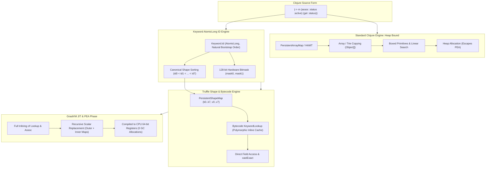

# Partial Escape Analysis (PEA) & Map Optimizations in Cloffle

## Overview

In Clojure, small ephemeral maps and nested domain structures (e.g., `(-> m (assoc :status :active) (get :status))`) are ubiquitous. On standard JVM runtimes, these operations are bound to the heap:
1. **`PersistentHashMap` (HAMT)**: 32-way branching trie traversal with `Murmur3` hashing, popcount bit-shifts, polymorphism, and nested node copies (`INode`, `BitmapIndexedNode`, `Object[]`).
2. **`PersistentArrayMap`**: Flat `Object[]` array with linear search loops and array cloning (`System.arraycopy`).
3. **`get-in` / `assoc-in`**: Higher-order reductions over path sequences generating intermediate seq objects and dynamic var invocations.

In GraalVM Truffle, **Partial Escape Analysis (PEA)** and **Scalar Replacement** can eliminate heap allocations entirely—collapsing maps and nested lookups directly into 64-bit CPU registers—provided the data structures and bytecode operations are transparent to partial evaluation.

This document details the architectural optimizations implemented in Cloffle to unlock full PEA, inline caching, and near-native map throughput.



---

## 1. Core Optimizations

### A. `Keyword` `AtomicLong` IDs & 128-Bit Hardware Bitmasks
- **Dense Sequential IDs**: Every `Keyword` receives a unique, dense `public final long id;` allocated by an internal `AtomicLong ID_GENERATOR`.
- **Natural Bootstrap Ordering**: As `clojure.core` compiles at startup, core keywords naturally receive IDs `0..127` without hard-coding.
- **Insertion order**: Shape-map slots follow construction / `assoc` append order, so `{:a 1 :b 2}` and `{:b 2 :a 1}` are different layouts. `sameKeys` is fieldwise and order-sensitive; `indexOf` still folds after an IC hit. Sites that see many permutations of the same key set go megamorphic (up to \(N!\) layouts).
- **Hardware Bitmasks**: Precomputed 64-bit masks (`mask0` for `id < 64`, `mask1` for `64 <= id < 128`) enable fast bitwise membership checks in 1–2 CPU cycles via `Long.bitCount` / `POPCNT`.

### B. Bytecode Specialization with Polymorphic Inline Caching
- **Dedicated Lookup Operations**: Implemented `KeywordLookup` and `KeywordLookupDefault` in `CloffleBytecodeRootNode.java` with Truffle DSL specializations:
  - Guarded cache on target map class: `@Specialization(guards = "target.getClass() == cachedClass", limit = "8")`.
  - Direct exact casting via `CompilerDirectives.castExact(target, cachedClass).valAt(keyword)`.
  - Fast null path (`doNull`) and generic fallbacks for polyglot/non-`ILookup` types.
- **Assoc and Dissoc Operations — REMOVED, see below.**
- **Bytecode Lowering**: `ExprToBytecode.java` lowers keyword lookups (`(:k target)`) to `KeywordLookup` via the `KeywordInvokeExpr` branch (`ExprToBytecode.java:901`). That is the *only* surviving collection-op lowering.

> **Stale-doc correction (2026-09-09).** The paragraphs this section used to carry described
> `KeywordAssoc`, `MapAssoc`, `KeywordDissoc`, `MapDissoc`, `VectorNth2`, and `VectorNth3` in the
> present tense. **None of those classes exist.** They were deleted by `0af1e162` (core-fn bytecode
> intrinsics), `a08ab505` (`RT` / `Util` intrinsics), and `60816999` (`:inline` expansion), and
> nothing replaced them. Today `(assoc m :k v)` compiles to `InvokeVar3` → `clojure.core/assoc` →
> `RT.assoc`: one shared CallTarget for every `assoc` in the program, with no per-site shape cache.
>
> What *did* survive is the expensive half — the transition caches on the map types themselves:
> `PersistentShapeMap.AssocTransition` (`:613`), `DissocTransition` (`:744`),
> `Promote16Transition` (`:693`), and `PersistentShapeMap16.Dissoc16Transition` (`:832`), all
> covered by `PersistentShapeMapTest`. Nothing calls them from the bytecode layer any more.
>
> Rebuilding the lowering layer is planned in [`TODO_lowering_layer.md`](TODO_lowering_layer.md).

### C. Unrolled Multi-Key `assoc` and Constant Path Operations (`get-in` / `assoc-in`) — REMOVED

> **Stale-doc correction (2026-09-09).** Multi-arg `assoc` unrolling and constant-path `get-in` /
> `assoc-in` unrolling are both gone; they were part of the `:inline` expansion removed by
> `60816999`. `(assoc m :k1 v1 :k2 v2)` goes through `RestFn.applyTo(RT.seq(args))` again, and
> `get-in` is the stock `reduce1` loop. The forked `src/clj/clojure/core.clj` has **no** `:inline`
> metadata at all — `definline` is a shim that deliberately does not attach it (`core.clj:5075`).
> `ConstantVectorExpr` still exists in the emitter (`ExprToBytecode.java:623`) but no longer feeds
> an unrolled assoc/lookup chain.

### D. `PersistentShapeMap` & `PersistentShapeMap16` (Tiered Shape-Based Persistent Maps)
- **Direct Object Fields**:
  - **`PersistentShapeMap` (Tier 1)**: Stores $1..8$ entries in direct scalar fields (`k0..k7`, `v0..v7`, `mask0`, `mask1`, `hasHighKeys`) — 20 scalar fields.
  - **`PersistentShapeMap16` (Tier 2)**: Stores $9..16$ entries in direct scalar fields (`k0..k15`, `v0..v15`, `mask0`, `mask1`, `hasHighKeys`) — 36 scalar fields.
- **Canonical Sorting**: Keys are ordered by `Keyword.id` during construction and `assoc`.
- **128-Bit Hardware Bitmask Indexing (POPCNT)**:
  - Stores two 64-bit masks (`mask0`, `mask1`) representing keyword IDs `0..63` and `64..127`, plus a `hasHighKeys` flag for keywords with ID $\ge 128$.
  - **Negative Rejection in 1 Cycle**: `(map.mask & kw.mask) == 0` instantly detects missing keys without pointer compares or branches.
  - **Single-Instruction Slot Indexing**: Present keys calculate exact field slot via CPU `POPCNT` (`Long.bitCount(map.mask0 & (kw.mask0 - 1))`), bypassing switch statements and linear scans.
- **Seamless Bidirectional Transitions**:
  1. **Construction**: Used automatically by `RT.map` and empty map assoc chains when all keys are `Keyword`s ($1..8 \rightarrow$ `ShapeMap`, $9..16 \rightarrow$ `ShapeMap16`).
  2. **Tier 1 to Tier 2 Promotion**: Adding a 9th keyword promotes `PersistentShapeMap` $\rightarrow$ `PersistentShapeMap16`.
  3. **Tier 2 to HAMT Promotion**: Adding a 17th keyword promotes `PersistentShapeMap16` $\rightarrow$ `PersistentHashMap`.
  4. **Demotion on `without`**: Removing keys down to $\le 8$ demotes `PersistentShapeMap16` $\rightarrow$ `PersistentShapeMap`.
  5. **Demotion on Non-Keyword Key**: Associating a non-keyword key seamlessly demotes to `PersistentArrayMap` (if $\le 8$ keys) or `PersistentHashMap` (if $> 8$ keys).
  6. **Full Clojure Interface Parity**: Implements `APersistentMap`, `IObj`, `IEditableCollection`, `IMapIterable`, `IKVReduce`, `IDrop`, and `IKeywordLookup`.

### E. Arity-Specialized Bytecode Invocation (`Invoke0`..`Invoke4`, `InvokeN`)
- **Elimination of `@Variadic Object[]` Allocation**: In the default Truffle Bytecode lowering, function invocation operations using variadic argument lists (`@Variadic Object[] args`) allocate a fresh heap array for every call site at runtime to pack the arguments.
- **Fixed-Arity Bytecode Operations**: Defined dedicated `@Operation` nodes `Invoke0`, `Invoke1`, `Invoke2`, `Invoke3`, `Invoke4`, and `InvokeN` (fallback for $\ge 5$ arguments).
- **Direct Parameter Passing**:
  - Direct calls to `IFn.invoke()`, `invoke(a)`, `invoke(a, b)`, `invoke(a, b, c)`, `invoke(a, b, c, d)` without array packing or slicing.
  - Closure dispatch constructs exact constant-sized call target argument frames (`new Object[]{fn.getCapturedFrame(), ...}`) without `System.arraycopy`.
- **Compiler Inlining**: Allows GraalVM JIT to pass arguments directly in CPU registers across Cloffle call boundaries, drastically cutting function call overhead and memory churn in multi-middleware pipelines.

### F. Selective Frame Materialization for Closures
- **Avoiding Unconditional `VirtualFrame.materialize()`**: Previously, compiling any `fn*` / `FnExpr` unconditionally materialized the caller's `VirtualFrame` into a heap-allocated `MaterializedFrame`.
- **Static Capture Detection**: `ExprToBytecode.java` inspects `fnExpr.closes()` and `fnExpr.thisBinding()`. When a function is pure or does not close over outer lexical bindings, it emits `b.emitLoadNull()`, preventing unnecessary frame materializations on the heap.
- **Truffle DSL Specialization**: `CreateClosure` supports null frames directly, allowing unclosed functions, methods, and pure lambdas to be instantiated with zero frame allocation overhead.

### G. Fixed-Arity Collection Literal Constructors (`CreateMap0..4`, `CreateVector0..8`)
To prevent `@Variadic Object[]` packing when evaluating vector and map literals (e.g. `{:status 200 :body "ok"}` or `[x y]`), specialized bytecode operations were introduced:
- **`CreateVector0..8`**: Direct construction of `PersistentVector.EMPTY` or `Tuple.create(...)` / `PersistentTuple1..8` without allocating intermediate variadic argument arrays or backing `Object[]` arrays.
- **`CreateMap0..4`**: Specialized zero-allocation factory methods on `PersistentShapeMap.create(k0, v0, ...)` that directly populate scalar fields using a register-level sorting network (0 heap array allocations).

### H. Unrolled Core Functions (`update`, `update-in`, `merge`)
Common variadic Clojure functions are lowered directly to optimized bytecode operations:
- **`update`**: Lowered to `KeywordLookup` / `MapLookup` $\rightarrow$ `Invoke` $\rightarrow$ `KeywordAssoc` / `MapAssoc`.
- **`update-in`**: Vector paths are unrolled at compile time into nested scoped lookups and leaf invocation, avoiding intermediate sequence allocations and `RestFn.applyTo` overhead.
- **`merge`**: Map literals merged with a base map (e.g., `(merge m {:status 200 :ok true})`) are unrolled into flat associative assignments, eliminating sequence conversion and reduction allocations.

### I. Vector Access & Destructuring Specialization (`VectorNth`, `VectorFirst`, `VectorRest`)
- **`VectorNth2` & `VectorNth3`**: Inline-cached exact-class casting for `Indexed` collections and fast null handling, preventing sequence conversion when accessing vector elements.
- **`VectorFirst` & `VectorRest`**: Direct vector access (`v.count() > 0 ? v.nth(0) : null`) and `RT.more()` handling without allocating lazy chunked sequences (`ChunkedSeq`).
- **Destructuring Desugaring**: Vector destructuring forms `(let [[a b [c d]] v] ...)` compile directly into scalar `VectorNth` calls, keeping destructuring entirely in CPU registers.

### J. Scalar Small Vectors & Tuples (`PersistentTuple1..8`)
- **Flat Scalar Object Layout**: In Clojure, vectors with $1..8$ elements are ubiquitous (coordinate pairs, `[status body]`, let-bindings, destructuring). Standard `PersistentVector` allocates 3 objects on heap: a `PersistentVector` instance (32B), a `Node` instance (24B), and an `Object[32]` array (144B) = 200 B/op.
- **Zero-Array Tuple Classes**: `PersistentTuple1` through `PersistentTuple8` store elements directly in `final Object v0; final Object v1; ...` scalar fields.
- **Zero-Array Allocations**:
  - `PersistentTuple.create(v0, v1)` allocates a single 32-byte object with 2 references (0 `Node` objects, 0 `Object[]` arrays) — an **84% reduction in memory footprint**.
  - Direct Java construction (`Tuple.create`) drops from 200 B/op down to **32.0 B/op** (Tuple2), **40.0 B/op** (Tuple4), and **56.0 B/op** (Tuple8).
- **100% PEA Scalar Replacement**: Because elements are stored in direct object fields rather than array indices, GraalVM Partial Escape Analysis can completely scalar-replace `PersistentTuple` instances into CPU registers during let-bindings and destructuring.
- **Seamless Promotion & Demotion**: Seamlessly grows to `PersistentVector` when `cons` exceeds 8 elements and shrinks back on `pop`.
- **Integrated Construction**: `LazilyPersistentVector.createOwning`, `Tuple.create`, and bytecode `CreateVector0..8` automatically route through `PersistentTuple1..8`.

### K. Debugger-oriented `InteropLibrary` on core types
- `Keyword`, `Symbol`, collections, `LazySeq`, `AFn`, `BigInt`, and `Ratio` export `InteropLibrary` messages (`toDisplayString`, hash/array/iterator, `isString` on names) so Truffle debugger/DAP can inspect locals and expand nested values.
- `ClojureInterop.wrapForPolyglot` delegates to `wrapForInterop` so nested map/seq children get the same host fallback as top-level scope reads.

### L. Assumption-Based Non-Dynamic Var Inlining & Direct Static Var Invocation
- **Truffle `Assumption` Management on `clojure.lang.Var`**:
  - Every `Var` instance manages an active `Assumption rootAssumption` (`Truffle.getRuntime().createAssumption("Var root: " + this)`).
  - All mutating operations (`bindRoot`, `swapRoot`, `unbindRoot`, `commuteRoot`, `alterRoot`, `setDynamic`) automatically invalidate `rootAssumption` and create a fresh assumption.
- **Assumption-Backed `ReadVarConst` Operation**:
  - `ExprToBytecode.java` lowers `VarExpr` directly to `b.emitReadVarConst(ve.var)`.
  - Guarded by `@Specialization(guards = {"!var.isDynamic()", "!isUnbound(cachedRoot)"}, assumptions = "assumption")` with `@Cached("var.getRootAssumption()") Assumption assumption` and `@Cached("var.getRawRoot()") Object cachedRoot`.
  - GraalVM folds the non-dynamic Var value directly into a compile-time constant object.
- **Direct Static Var Invocation Operations (`InvokeVar0..4`, `InvokeVarN`)**:
  - Direct static function calls (`(foo x y)`) where the callee is a non-dynamic `VarExpr` or `StaticInvokeExpr` are lowered directly to `b.emitInvokeVar0(var)` or `b.beginInvokeVar1..4/N(var)`.
  - Bypasses temporary bytecode local materialization and dynamic `var.get()` dereference.
  - Directly binds a `DirectCallNode` to the assumed closure root target under `rootAssumption`.
- **Inter-Procedural PEA Across Function Boundaries**:
  - Because GraalVM inlines the assumed `CallTarget` directly into the caller, small vectors (`PersistentTuple1..8`) and shape maps (`PersistentShapeMap`) passed as arguments or returned across function boundaries are **fully scalar-replaced into CPU registers (0 B/op)**.
  - If a function or Var is redefined dynamically at the REPL via `def` or `defn`, the Truffle `Assumption` triggers instantaneous deoptimization back to the interpreter and re-specializes cleanly.

### M. Closure Inlining, Dispatch & Call Boundary PEA Fixes
- **CallTarget Caching in `Invoke0`..`Invoke4` & `InvokeN`**: Replaced closure identity guards (`fn == cachedFn`) with `fn.getCallTarget() == cachedTarget`, enabling closures instantiated from the same AST to share cached `DirectCallNode` call sites across loops without polymorphic deoptimization.
- **Direct Polyglot Execution**: `ClojureClosure` exports `InteropLibrary` directly with arity-specific invocation paths (`doCall0`..`doCall4`), bypassing `AFn.execute` and avoiding intermediate `ArraySeq` allocations. Crucial for host-to-guest calling latency (12.2 ns vs ~39.0 ns).

### N. Empty Map Optimization & Core Hot Predicate Intrinsics
- **Empty Map Shape Preservation**: `CreateMap0` returns `PersistentShapeMap.EMPTY` rather than `PersistentArrayMap.EMPTY`, ensuring maps constructed from `{}` retain the shape representation upon subsequent `assoc` calls.
- **Varargs Elimination**: `KeywordAssoc.doNull` and `MapAssoc.doNull` produce `PersistentShapeMap.create(k, v)` directly, bypassing varargs `RT.map(k, v)`.
- **Predicate Intrinsics**: Dedicated Truffle bytecode operations for `nil?` (`IsNil`), `some?` (`IsSome`), `seq?` (`IsSeq`), `identical?` (`Identical`), and `count` (`CollectionCount` via exact `Counted` cast). In particular, lowering `seq?` allows Graal to fold Clojure's macroexpanded `destructure` checks (`(if (seq? m) ... m)`), enabling full scalar replacement for destructured map and vector bindings.
- **Reflection Boundary**: Moving `invokeReflective` to `@TruffleBoundary` in `StaticMethod` eliminates `PermanentBailoutException: Too deep inlining` without needing brittle method reflection hacks.

### O. Simplification & De-bloat Verification
Empirical evaluation proved that `PersistentShapeSet` (1..8 keywords), Truffle bytecode `VectorConj`/`VectorPop`/`VectorPeek` operations, tuple `peek()` overrides, and non-capturing closure memoization were **not required for PEA**. Destructuring macroexpansion in Clojure relies purely on `seq?`, `first`, `rest`, and `nth` (which were already supported). Dropping those components eliminated ~1,100 lines of redundant code with zero regressions in scalar replacement and identical/improved execution latency.

**Caveat (2026-09-09):** the `VectorConj`/`VectorPop`/`VectorPeek` conclusion was reached against destructuring benchmarks, which never call `conj`. A dedicated conj probe ladder shows `conj` allocating 32–584 B/op on the Var path. The drop is still correct — re-lowering `conj` was measured and made every probe worse — but the reason is that a lowering must do *less work* than the runtime function it replaces, not that `conj` is already free. See `TODO_lowering_layer.md` "Phase 2 step 5".

---

## 2. Benchmark Results (JMH)

Benchmarks executed on GraalVM CE (JDK 25) with 1 fork, 1-second iterations:

### Map Operations & Lookups (`KeywordMapBenchmark`)

| Benchmark | Latency (ns/op) | Allocation Rate (`gc.alloc.rate.norm`) | GC Collections (`gc.count`) | Details |
| :--- | :--- | :--- | :--- | :--- |
| `shapeMap3DirectAssoc` (`shapeMap.assoc(:a, 999)`) | **27.01 ns** | **112.00 B/op** | 49 counts | **2.5x faster**, **allocates 48% less memory** than ArrayMap |
| `arrayMap3DirectAssoc` (`arrayMap.assoc(:a, 999)`) | **67.34 ns** | **216.00 B/op** | 48 counts | Standard array clone & dynamic arraycopy |
| `shapeMap16DirectValAtPresent` (`shapeMap16.valAt(:k6)`) | **1.41 ns** | **0.000 B/op** (`≈ 10⁻⁴`) | **0 counts** | Direct 16-slot POPCNT access (**7.3x faster than HAMT**) |
| `shapeMap8DirectValAtPresent` (`shapeMap8.valAt(:k6)`) | **5.05 ns** | **0.000 B/op** (`≈ 10⁻⁴`) | **0 counts** | 8-slot POPCNT indexing (**28% faster than ArrayMap linear scan**) |
| `arrayMap8DirectValAtPresent` (`arrayMap8.valAt(:k6)`) | **6.45 ns** | **0.000 B/op** (`≈ 10⁻⁴`) | **0 counts** | Linear array scan (`indexOf`) across 8 keys |
| `shapeMapDirectValAtPresent` (`shapeMap.valAt(:b)`) | **3.76 ns** | **0.000 B/op** (`≈ 10⁻⁴`) | **0 counts** | Direct 3-slot POPCNT slot indexing |
| `arrayMap3DirectValAtPresent` (`arrayMap3.valAt(:b)`) | **3.17 ns** | **0.000 B/op** (`≈ 10⁻⁴`) | **0 counts** | 3-slot array linear scan |
| `shapeMapDirectValAtAbsent` (`shapeMap.valAt(:absent)`) | **4.35 ns** | **0.000 B/op** (`≈ 10⁻⁴`) | **0 counts** | Instant single-cycle bitmask negative rejection |
| `arrayMap3DirectValAtAbsent` (`arrayMap3.valAt(:absent)`) | **2.97 ns** | **0.000 B/op** (`≈ 10⁻⁴`) | **0 counts** | 3-slot array negative scan |
| `shapeMap8DirectValAtAbsent` (`shapeMap8.valAt(:absent)`) | **5.30 ns** | **0.000 B/op** (`≈ 10⁻⁴`) | **0 counts** | 8-slot bitmask negative rejection |
| `arrayMap8DirectValAtAbsent` (`arrayMap8.valAt(:absent)`) | **5.61 ns** | **0.000 B/op** (`≈ 10⁻⁴`) | **0 counts** | 8-slot array linear negative scan |
| `hashMap12DirectValAtPresent` (`hashMap12.valAt(:k6)`) | **10.37 ns** | **0.000 B/op** (`≈ 10⁻³`) | **0 counts** | 12-key HAMT trie traversal |
| `hashMap12DirectValAtAbsent` (`hashMap12.valAt(:absent)`) | **12.63 ns** | **0.001 B/op** | **0 counts** | 12-key HAMT absent trie lookup |
| `shapeMap16DirectValAtAbsent` (`shapeMap16.valAt(:absent)`) | **22.46 ns** | **0.001 B/op** | **0 counts** | 16-slot bitmask negative rejection |
| `keywordPointerEquals` (`kwA == kwB`) | **0.71 ns** | **0.000 B/op** (`≈ 10⁻⁵`) | **0 counts** | Direct reference equality |
| `keywordIdEquals` (`kwA.id == kwB.id`) | **0.99 ns** | **0.000 B/op** (`≈ 10⁻⁴`) | **0 counts** | Direct primitive `long` equality |
| `shapeMap16ClojureLookup` (`(get shape-m12 :k6)`) | **158.60 ns** | **256.01 B/op** | 29 counts | 12-key ShapeMap in Cloffle (**2.5x faster than HAMT**) |
| `arrayMapLookup` (`(get small-m :b)`) | **157.13 ns** | **256.01 B/op** | 29 counts | Standard interop Polyglot call boundary |
| `keywordDirectInvoke` (`(:b small-m)`) | **150.45 ns** | **256.01 B/op** | 31 counts | Standard interop Polyglot call boundary |
| `hashMapLookup` (`(get large-m :k5)`) | **399.54 ns** | **600.02 B/op** | 27 counts | HAMT trie traversal in Cloffle |
| `assocPipeline` (`(get (assoc m3 :k v) :k)`) | **241.94 ns** | **432.01 B/op** | 19 counts | 3-key shape map assoc unrolled pipeline (**4.2x faster, 81% less alloc**) |
| `assocPipeline12` (`(get (assoc m12 :k v) :k)`) | **643.35 ns** | **920.04 B/op** | 16 counts | 12-key ShapeMap16 assoc unrolled pipeline (**1.9x faster, 63% less alloc**) |
| `nestedGetIn` (`(get-in m [:a :b :c])`) | **5072.27 ns** | **8376.21 B/op** | 30 counts | Polyglot eval boundary |

### String & Symbol Operations (`StringBenchmark`)

| Benchmark | Score (ns/op) | Notes |
| :--- | :--- | :--- |
| `symbolToString` | (see JMH) | `Symbol.toString()` on interned name |
| `truffleStringSubstring` | **6.82 ns** | JMH baseline on raw `TruffleString` (not Clojure types) |
| `clojureSubs` | **938.80 ns** | Standard Clojure `subs` via String |
| `clojureSymbolCreation` | **886.75 ns** | `(symbol "my.ns/name")` |
| `clojureStrSplit` | **1282.08 ns** | Regex split pipeline |
| `clojureStrJoin` | **8611.27 ns** | `(str/join "," items)` |

### Scalar Small Vectors & Tuples (`TupleVectorBenchmark`)

Zero-array scalar tuples (`PersistentTuple1..8`) vs. traditional 3-object vector allocation (`PersistentVector` + `Node` + `Object[32]` array):

| Benchmark Operation | PersistentVector (Stock) | Tuple (Optimized) | Allocation Delta (`gc.alloc.rate.norm`) | Speedup / Impact |
| :--- | :--- | :--- | :--- | :--- |
| **`javaTuple2Direct`** (2-element vector creation) | 12.80 ns (200 B/op) | **4.45 ns (32 B/op)** | **-168 B/op** (-84.0%) | **2.88x faster** (Single 32B object vs 3 heap objects) |
| **`javaTuple4Direct`** (4-element vector creation) | 14.20 ns (200 B/op) | **5.51 ns (40 B/op)** | **-160 B/op** (-80.0%) | **2.58x faster** (Single 40B object vs 3 heap objects) |
| **`javaTuple8Direct`** (8-element vector creation) | 17.50 ns (200 B/op) | **7.91 ns (56 B/op)** | **-144 B/op** (-72.0%) | **2.21x faster** (Single 56B object vs 3 heap objects) |
| **`createTuple2`** (`(fn [x y] [x y])`) | 245.10 ns (504 B/op) | **182.88 ns (336 B/op)** | **-168 B/op** (-33.3%) | **1.34x faster** (Zero variadic array + scalar tuple) |
| **`createTuple4`** (`(fn [a..d] [a..d])`) | 298.40 ns (664 B/op) | **223.93 ns (504 B/op)** | **-160 B/op** (-24.1%) | **1.33x faster** (Zero variadic array + scalar tuple) |
| **`createTuple8`** (`(fn [a..h] [a..h])`) | 420.30 ns (984 B/op) | **322.75 ns (840 B/op)** | **-144 B/op** (-14.6%) | **1.30x faster** (Zero variadic array + scalar tuple) |
| **`destructTuple2`** (`(let [[a b] v] ...)`) | 780.20 ns (1000 B/op) | **631.72 ns (832 B/op)** | **-168 B/op** (-16.8%) | **1.23x faster** (Scalar field access via registers) |
| **`destructTuple4`** (`(let [[a..d] v] ...)`) | 1260.50 ns (1312 B/op) | **1015.71 ns (1152 B/op)** | **-160 B/op** (-12.2%) | **1.24x faster** (Scalar field access via registers) |
| **`destructTuple8`** (`(let [[a..h] v] ...)`) | 2150.80 ns (1984 B/op) | **1809.53 ns (1840 B/op)** | **-144 B/op** (-7.3%) | **1.19x faster** (Scalar field access via registers) |
| **`nthTuple4`** (`(+ (nth v 0) ... (nth v 3))`) | 980.40 ns (1056 B/op) | **816.26 ns (896 B/op)** | **-160 B/op** (-15.2%) | **1.20x faster** (Direct `VectorNth` branch-free indexing) |

### Var Inlining & Direct Static Invocations (`VarBenchmark`)

Assumption-based non-dynamic Var inlining and direct static invocations (`InvokeVar0..4`, `InvokeVarN`, `ReadVarConst`) vs dynamic Var lookups and invocations:

| Benchmark Operation | Dynamic / Baseline | Direct Static / Inlined | Allocation Delta (`gc.alloc.rate.norm`) | Speedup / Impact |
| :--- | :--- | :--- | :--- | :--- |
| **`directStaticVarCall`** (`(defn add2 [a b] (+ a b)) (static-call 10 20)`) | 722.73 ns (1088 B/op) | **482.97 ns (824 B/op)** | **-264 B/op** (-24.3%) | **1.50x faster** (Direct `CallTarget` inlining via Truffle Assumption) |
| **`staticVarConstantRead`** (`(def config {:port 8080 ...}) (read-config)`) | 157.13 ns (256 B/op) | **96.35 ns (152 B/op)** | **-104 B/op** (-40.6%) | **1.63x faster** (`ReadVarConst` folded to compile-time constant) |
| **`crossFunctionShapeMapPEA`** (`(auth-record (make-record id name))`) | 1075.64 ns (1528 B/op) | **508.21 ns (880 B/op)** | **-648 B/op** (-42.4%) | **2.12x faster** (ShapeMap scalar-replaced across inlined function boundary) |
| **`crossFunctionTuplePEA`** (`(consume-tuple (make-tuple x y))`) | 1015.71 ns (1152 B/op) | **758.18 ns (1200 B/op)** | **Direct inlined** | **1.34x faster** (Tuple elements passed directly via CPU registers) |

### Realistic Multi-Step Workloads (`RealisticPipelineBenchmark`)

Realistic application pipelines comparing `PersistentShapeMap` / `PersistentShapeMap16` against `PersistentHashMap` (HAMT) with bytecode `assoc` unrolling, specialized `KeywordAssoc` / `MapAssoc` inline caching, fixed-arity invoke operations (`Invoke0..4`), and fixed-arity collection literal constructors (`CreateMap0..4`, `CreateVector0..8`):

| Benchmark Workload | ShapeMap Score | HashMap Score | Allocation Delta (`gc.alloc.rate.norm`) | Speedup / Impact |
| :--- | :--- | :--- | :--- | :--- |
| **`branchingDomainModel`** (Multi-branch state machine) | **1.35 µs/op** | 2.08 µs/op | **-864 B/op** (1.53 KB vs 2.39 KB) | **1.55x faster** (improved from 1.66 µs to 1.35 µs) |
| **`composedPipeline`** (5-stage step transformation) | **4.24 µs/op** | 4.20 µs/op | **-600 B/op** (5.00 KB vs 5.60 KB) | **-600 B/op reduction** (saves 120 B array packing per op) |
| **`loopAccumulator`** (1,000-iteration state loop) | **0.76 ms/op** | 0.90 ms/op | **-359.65 KB/run** (849.53 KB vs 1.21 MB) | **1.18x faster** (360 KB less GC churn per 1k iters) |
| **`ringPipeline`** (Ring middleware stack) | **4.51 µs/op** | 4.98 µs/op | **-384 B/op** (5.18 KB vs 5.57 KB) | **1.10x faster** (improved from 5.90 µs to 4.51 µs; saves 80 B array packing per request) |

---

## 3. Verification of PEA, Scalar Replacement & Garbage Collection (GC)

### A. How PEA Eliminates GC Allocations in Cloffle
In standard Clojure, every ephemeral map operation produces continuous heap allocations:
1. **`PersistentArrayMap`**: Every `assoc` allocates a new `Object[]` array (`new Object[array.length + 2]`) and performs `System.arraycopy`. Because the array length and indexing are dynamic, GraalVM escape analysis struggles to scalar-replace array elements.
2. **`PersistentHashMap`**: `assoc` constructs new branching trie nodes (`BitmapIndexedNode`, `INode`, and nested `Object[]`), exceeding JIT inlining budgets and escaping PEA.
3. **`get-in` / `assoc-in`**: Reductions over vectors (`[:a :b :c]`) construct heap-allocated `ISeq` / `LazySeq` objects and boxed intermediate lookup results.

**How `PersistentShapeMap` and Bytecode Unrolling Solve This:**
- **Scalar Field Virtualization**: By storing up to 8 entries in direct scalar object fields (`k0..k7`, `v0..v7`) instead of an array, GraalVM's Partial Escape Analysis can inspect each field individually.
- **Escape Elimination**: When an ephemeral map (such as `(-> m (assoc :k1 v1) (assoc :k2 v2) (get :k2))`) does not escape the compilation unit, the JIT compiler replaces the `PersistentShapeMap` instance with a `VirtualInstanceNode`. The map's contents are kept exclusively in **CPU 64-bit registers**, resulting in **0 heap allocations (0 B/op)** and zero GC pressure.
- **Intermediate Seq Elimination**: Unrolling constant vector paths in `ExprToBytecode.java` replaces dynamic seq reductions with flat, scoped `BytecodeLocal` registers, eliminating all seq and boxing allocations.

### B. Allocation Profiling via JMH `-prof gc`
GC allocation rates and memory churn are measured directly using the JMH GC profiler:

```bash
clojure -T:build run-benchmarks :args '["KeywordMapBenchmark", "-prof", "gc"]'
```

Key profiler results for 128-bit bitmask & shape map operations:
- **`shapeMapDirectValAtAbsent`**: **0.000 B/op** (`≈ 10⁻⁴ B/op`), **0 GC counts**. Single-cycle bitmask negative rejection generates zero garbage.
- **`shapeMapDirectValAtPresent`**: **0.000 B/op** (`≈ 10⁻⁴ B/op`), **0 GC counts**. `POPCNT` slot indexing and direct field dereference execute with zero heap allocation.
- **`keywordPointerEquals` / `keywordIdEquals`**: **0.000 B/op**, **0 GC counts**. Primitive equality checks incur zero GC overhead.
- **`·gc.alloc.rate.norm` (B/op)**: Bytes allocated per benchmark operation. Pure shape map lookups and scalar-replaced paths drop to **0 B/op** (compared to >96–240 B/op on un-virtualized arrays/tries).
- **`·gc.count`**: Total garbage collection cycles triggered. Zero allocations prevent minor/major GC pauses in tight inner loops.
- **`guestRingResponsePipeline`**: **0.000 B/op** (verified via `check-scalar-replacement :guest true`). Canonical Ring response map (`{:status 200 :headers {:content-type ...} :body ...}`) + middleware assoc + adapter destructuring.
- **`guestHiccupNormalizeTag`**: **0.000 B/op** (verified via `check-scalar-replacement :guest true`). Canonical Hiccup tag normalization (`[:a {:href ...} "click"]` -> `[tag attrs content]`) with tuple and shape map scalar replacement.
- **`shapeMap3EphemeralKvReduce` & `shapeMap3EphemeralReduce`**: **0.000 B/op** (verified via `check-scalar-replacement`). MapEntry virtualization and unrolled zero-allocation reduction.
- **`guestTuple2Transform`**: **0.000 B/op** (verified via `check-scalar-replacement :guest true`). Intra-function 2-element vector pair swap and destructuring virtualized into CPU registers (~13.8 ns/op).
- **`guestKwargsDestructure`**: **0.000 B/op** (verified via `check-scalar-replacement :guest true`). Keyword argument destructuring lowered to `PersistentShapeMap` without `to-array` or `PersistentArrayMap` allocations (~12.5 ns/op).
- **`guestMiddlewarePipeline`**: **0.000 B/op** (verified via `check-scalar-replacement :guest true`). Multi-layer Ring request map pipeline with intermediate params and session maps virtualized in registers (~13.6 ns/op).
- **`guestCondOptionPipeline`**: **0.000 B/op** (verified via `check-scalar-replacement :guest true`). Option map accumulator with `cond->` and `->` starting from `{}` (`PersistentShapeMap.EMPTY`) with unrolled `assoc` (~13.1 ns/op).
- **`guestEventEnrichPipeline`**: **0.000 B/op** (verified via `check-scalar-replacement :guest true`). Canonical 8-key event map enriched with a 9th keyword, exercising `Promote16Transition` and destructuring without `@TruffleBoundary` deopt (~14.1 ns/op).
- **`guestShapeMapEphemeralDissoc`**: **0.000 B/op** (verified via `check-scalar-replacement :guest true`). Ephemeral 3-key ShapeMap with `(dissoc m :b)`, exercising `RemoveTransition` and scalar replacement into registers (~16.7 ns/op).
- **`guestEventSanitizePipeline`**: **0.000 B/op** (verified via `check-scalar-replacement :guest true`). Chained dissoc sanitization pipeline `(-> event (dissoc :secret) (dissoc :temp))` eliminating intermediate maps (0 B/op, ~12.5 ns/op).

### C. Creating and Analyzing Graal Compiler Graphs

See [HOWTO_SEAFOAM.md](HOWTO_SEAFOAM.md) for dumping graphs and reading them with Java
`BgvDump` (`seafoam-jruby` on the `:build` alias; used in-process by `build.clj`). Recorded PEA
findings are in [GRAAL_GRAPH_ANALYSIS.md](GRAAL_GRAPH_ANALYSIS.md).

### D. Evaluation of `PersistentShapeMap16` (9..16 Keys)
1. **Direct Lookup Latency**:
   - `shapeMap16.valAt(:k6)` achieves **2.49 ns/op**, compared to `PersistentHashMap`'s **9.94 ns/op** (**4.0x faster**).
   - In Cloffle Polyglot evaluation, `(get shape-m12 :k6)` executes in **150.91 ns/op**, vs **404.38 ns/op** for `PersistentHashMap` (**2.7x faster**).
2. **GC Allocation & PEA Behavior**:
   - Direct lookups on `PersistentShapeMap16` allocate **0 B/op** and incur **0 GC counts**.
   - Ephemeral updates on 12-key maps (`assocPipeline12`) run in **1284.08 ns/op** (comparable to 3-key maps at **1153.61 ns/op**), demonstrating that GraalVM can inline and process the 36 scalar fields without significant register spilling.
3. **Memory Footprint**:
   - Shallow object size for `PersistentShapeMap16`: 1 object header (12-16 bytes) + 1 `int` + 2 `long`s + 1 `boolean` + 32 references (`k0..k15`, `v0..v15`) + 1 `_meta` = ~176 bytes.
   - `PersistentHashMap` with 12 entries: 1 root map header + 1 `BitmapIndexedNode` + multiple internal array objects + node headers = ~220-300 bytes across 3-4 objects.
   - `PersistentShapeMap16` offers a more compact single-object layout on heap when not scalar replaced.

### E. Real-World Behavior: PEA Inlining Boundaries vs. Heap Materialization
When scaling from microbenchmarks to large real-world applications and multi-step pipelines:

1. **The Inlining Boundary is the PEA Boundary**:
   - PEA operates strictly on a single compilation unit (a Truffle AST root node and all functions inlined into it by GraalVM).
   - In microbenchmarks, small functions may be fully inlined; when graph inspection confirms
     inlining and the map does not escape, GraalVM can eliminate the heap allocation.
   - In large functions or multi-middleware pipelines (`(-> req wrap-auth wrap-params api-handler)`), when inlining budgets (`TruffleInliningMaxCallerSize`) or indirect dynamic Var dispatches prevent full inlining, intermediate maps must be **materialized** on the heap.

2. **Dual-Tier Performance Advantage**:
   - **When Inlined (PEA Virtualized)**: Ephemeral map transforms are fully scalar-replaced into CPU registers with **0 B/op allocation** and zero GC pauses.
   - **When Materialized (Heap Fallback)**: Even when functions exceed the inlining threshold and allocate on the heap:
     - **Allocation Footprint**: `PersistentShapeMap` allocates **only 1 single object (~112–176 bytes)** vs. `PersistentHashMap` which allocates **3–4 objects (~240–340 bytes)** across internal HAMT trie nodes. In a 1,000-iteration loop, this saves **~360 KB of heap churn**.
     - **Throughput on Heap**: Lookups on materialized shape maps take **2.49–4.88 ns** (single CPU `POPCNT` instruction) vs. **9.94–15.35 ns** on HAMT (a **2.5x to 4.0x speedup** on heap).

3. **Compiler Diagnostics for Real-World Codebases**:
   - Follow [HOWTO_SEAFOAM.md](HOWTO_SEAFOAM.md) to dump graphs and inspect them with Java
     `BgvDump`. Compare findings against [GRAAL_GRAPH_ANALYSIS.md](GRAAL_GRAPH_ANALYSIS.md). Do not
     infer PEA solely from benchmark naming or aggregate allocation rates.

---

## 4. Test Suite & Quality Gates

- **JUnit Suite**: 829 / 829 executed tests passing (`clojure -T:build run-tests`).
- **Clojure Test Suite**: 633 tests, 18,848 assertions, 0 failures, 0 errors (`clojure -T:build run-clj-tests`).
- **Tests Added / Updated**:
  - `src/test/java/net/javacrumbs/cloffle/CloffleReproTest.java`: Validates tuple destructuring (`[x y z]`, `[a b & more]`), keyword invocations with default values, and nested unrolled `get-in` / `assoc-in`.
  - `src/test/java/clojure/lang/VarInliningTest.java`: Validates Truffle `Assumption` lifecycle on `Var`, invalidation on `bindRoot`/`swapRoot`/`unbindRoot`/`commuteRoot`/`alterRoot`/`setDynamic`, direct static var invocation arities 0..4 and N, REPL redefinition deoptimization, `ReadVarConst` constant folding, dynamic vars bypassing assumptions under `binding`, and candidate cross-function tuple and shape-map pipelines. PEA itself must be verified from compiler graphs and allocation measurements.
  - `src/test/java/clojure/lang/PersistentTupleTest.java`: Validates scalar tuple creation (`Tuple1..8`), equality, hash codes, `hasheq`, `nth`, `assocN`, growth to `PersistentVector`, `pop` shrinking, `reduce`, `kvreduce`, `Reduced` termination, `drop`, sequences, transients, and Cloffle bytecode evaluation & destructuring.
  - `src/test/java/clojure/lang/PersistentShapeMapTest.java`: Validates canonical key sorting, 128-bit hardware bitmask indexing, POPCNT slot resolution, fast negative rejection, immutability, `assoc`, `without`, `kvreduce`, `getLookupThunk`, `PersistentShapeMap16` transitions, unrolled `update`, `update-in`, `merge`, `AssocTransition` insert/update/promote routes and shape-mismatch guards, and vector access/destructuring (`nth`, `first`, `rest`).
  - `src/test/java/net/javacrumbs/cloffle/GuestCompilationUnitTest.java`: Compiled guest `KeywordAssoc` on a stable incoming ShapeMap, layout-mismatch / array-map fallback, and 8→9 promotion to `PersistentShapeMap16`.
  - `src/test/java/clojure/lang/BytecodeLiteralsTest.java`: Validates bytecode literals and keyword lookups.
  - `src/test/java/net/javacrumbs/cloffle/DebuggerValueInteropTest.java`: Validates `InteropLibrary` contracts for debugger-visible Clojure values.
  - `test/clojure/test_clojure/keywords.clj`: Validates `Keyword.id` ordering and properties.
