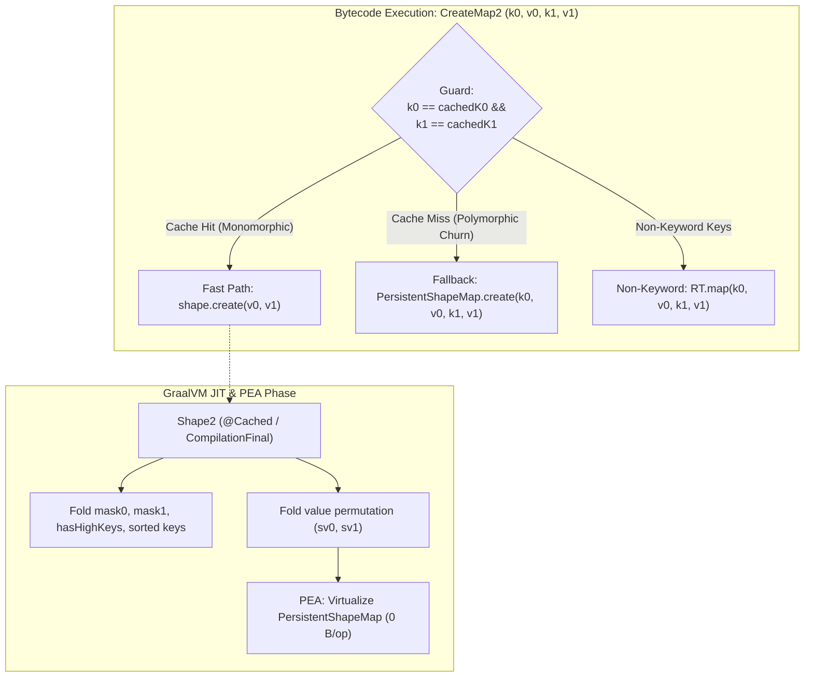

# Cached Shape Creation for Cloffle Map Literals

## Overview

In Clojure, small map literals with 1 to 4 keys (e.g. `{:a 1, :b 2}`) are frequent across application code, configuration dictionaries, and intermediate records. Cloffle compiles these forms into dedicated Truffle bytecode operations: `CreateMap1`..`CreateMap8`.

Previously, every execution of these bytecode instructions invoked `PersistentShapeMap.create(...)`, which performed runtime setup on every evaluation:
1. **Duplicate key validation**: Pairwise identity comparisons across all input keys.
2. **Sorting network execution**: Conditional swaps on `Keyword.id` to place keys and values into canonical ascending ID order.
3. **Bitmask computations**: Bitwise OR loops over `mask0`, `mask1`, and checks for `id >= 128` (`hasHighKeys`).

Because Clojure map literals almost always use stable keyword keys across repeated invocations, performing duplicate validation, key sorting, and mask calculation on every execution introduces avoidable interpreter overhead and impedes GraalVM Partial Escape Analysis (PEA).

By introducing **precomputed Shape descriptors** and **Truffle DSL inline caching (`@Cached`)** on `CreateMap1`–`CreateMap8`, shape sorting and mask generation are executed once per distinct literal key combination. Graal's compiler treats the cached shape as a compile-time constant (`@CompilationFinal`), folding sorting permutations and mask arithmetic away entirely.



---

## Architecture & Implementation

### 1. Shape Descriptors (`PersistentShapeMap.java`)

Static shape helper classes on `clojure.lang.PersistentShapeMap`: `Shape1`..`Shape8` (cached literal descriptors).

Each descriptor captures the structural invariant of a map literal shape:
- Canonical sorted keys (`k0..k3`) based on `Keyword.id`.
- Precomputed 64-bit masks (`mask0`, `mask1`) and high-key flags (`hasHighKeys`).
- Value routing metadata:
  - `Shape2`: A boolean `swapped` indicating whether `v0` and `v1` must exchange positions.
  - `Shape3` and `Shape4`: Compact `byte` permutation indices (`p0..p3`) that map original argument positions to sorted storage slots.

```java
// Example: Shape2 captures canonical ordering and routing
public static final class Shape2 {
    public final Keyword k0, k1;
    public final long mask0;
    public final long mask1;
    public final boolean hasHighKeys;
    public final boolean swapped;

    public Shape2(Keyword a, Keyword b) {
        if (a == null || b == null) throw new IllegalArgumentException("Key cannot be null in ShapeMap");
        if (a == b) throw new IllegalArgumentException("Duplicate key: " + a);
        this.swapped = a.id > b.id;
        this.k0 = swapped ? b : a;
        this.k1 = swapped ? a : b;
        this.mask0 = k0.mask0 | k1.mask0;
        this.mask1 = k0.mask1 | k1.mask1;
        this.hasHighKeys = (k0.id >= 128) || (k1.id >= 128);
    }

    public PersistentShapeMap create(Object v0, Object v1) {
        Object sv0 = swapped ? v1 : v0;
        Object sv1 = swapped ? v0 : v1;
        return new PersistentShapeMap(null, 2, mask0, mask1, hasHighKeys,
                k0, sv0, k1, sv1, null, null, null, null, null, null, null, null, null, null, null, null);
    }
}
```

Because `swapped` and `p0..p3` are constant fields on a cached shape instance, the `pickN(...)` / ternary branches are evaluated and folded during partial evaluation.

### 2. Bytecode Node Specializations (`CloffleBytecodeRootNode.java`)

In `CloffleBytecodeRootNode`, `CreateMap1`–`CreateMap4` were updated using Truffle DSL polymorphism:

1. **`doKeywordCached` (`@Specialization(guards = {...}, limit = "2")`)**:
   - Compares the runtime keywords by identity against cached keyword instances.
   - Injects a cached `PersistentShapeMap.ShapeN` instance computed via `@Cached("shapeN(cachedK0, ...)")`.
   - Delegates directly to `shape.create(v0, ...)`.
2. **`doKeyword` (`@Specialization(replaces = "doKeywordCached")`)**:
   - Falls back to `PersistentShapeMap.create(...)` when a call site encounters polymorphic keyword churn beyond the cache limit.
3. **`doGeneric` (`@Specialization(guards = "!areKeywords(...)")`)**:
   - Falls back to standard Clojure `RT.map(...)` if any key expression evaluates to a non-keyword type.

#### Bytecode Wire Format Compatibility
Because the caching is managed by Truffle DSL nodes during bytecode execution rather than introducing new opcodes or modifying `@ConstantOperand` layouts, the bytecode archive format is completely unaffected. No modifications were needed in `CloffleBytecodeSerializer`, `CloffleBytecodeDeserializer`, or cached `.bc` files.

---

## Why This Improves Partial Escape Analysis (PEA)

In GraalVM, PEA scalar replacement fails when a path through an object's constructor or subsequent methods contains unresolved branches, unknown memory reads, or dynamic type checks that exceed inlining budgets.

With cached shape descriptors:
1. **Compile-Time Constant Shape**: When a shape is `@Cached`, Truffle treats all its fields as compile-time constants (`@CompilationFinal`).
2. **Zero Inlining Pressure on Sorting**: The 5-step sorting network and duplicate checking loops do not appear in the JIT graph of the compiled function.
3. **Deterministic Downstream Lookups**:
   - When downstream code executes a lookup such as `(:b m)` or `(get m :b)`:
     - The target keyword's bitmask is constant.
     - The map's `mask0` and `mask1` are constant.
     - `(sm.mask0 & kmask)` folds to a non-zero constant.
     - `Long.bitCount(sm.mask0 & lowerMask)` evaluates at compile-time to an exact slot index (e.g. `1`).
     - The entire lookup expression collapses into a single direct read of register `sv1`.
4. **Complete Allocation Elimination**: If the map does not escape the compilation unit, Graal's `FinalPartialEscapePhase` completely eliminates the allocation of `PersistentShapeMap`, running with **0 B/op** overhead.

---

## Unrolled `assoc` insert and 8→16 promote

Cached shapes cover **map literal creation**. Existing-key `assoc` was already a field rewrite (copy `v0..v7`, overwrite one slot, `new PersistentShapeMap(...)`). New-key insert still allocated `Keyword[]` / `Object[]` and called `createFromSorted`, so ephemeral insert measured **64 B/op**.

`PersistentShapeMap.assoc` now inserts without arrays:

1. **Insert index** from unrolled `kw.id` comparisons against `k0..k7` (keys are already sorted by id).
2. **Masks** as `mask0 | kw.mask0`, `mask1 | kw.mask1`, `hasHighKeys || (kw.id >= 128)`.
3. **Count 0–7**: switch on insert slot, shift fields right, `new PersistentShapeMap(...)`.
4. **Size == 8**: private `assocPromote16` switch (`ins` 0..8), `new PersistentShapeMap16(...)` with nine occupied slots.
5. **`PersistentShapeMap16` insert (9..15)**: unrolled field shift (no `Keyword[]` / `Object[]`).
6. **`without` / demote**: bitmask slot resolve + unrolled left shift; Shape16 size 9 demotes to ShapeMap size 8 without arrays.

Host JMH `shapeMap3EphemeralInsertThenLookup` (local create, static keywords, primitive consume, no `MethodFilter`): **~0.32 ns/op**, **≈ 10⁻⁴ B/op**. `check-scalar-replacement` on that method: After parsing still shows boxing alloc nodes; FinalPartialEscapePhase **4 linear nodes**; After low tier **5 linear nodes**, no leftover heap allocs.

Guest `guestShapeMapEphemeralInsert` (`{:a 1 :b 2}` then `(assoc m :c x)`, consume with `+`) still measures **~864 B/op** (~186 ns/op) versus **~208 B/op** for existing-key `guestShapeMapEphemeralPipeline`. Unrolled insert plus class-cached `KeywordAssoc` does not yet yield guest PEA. Caching a `Shape2`→`Shape3` transition on assoc would not close that gap while the guest compilation unit still commits maps / call-target arrays.

---

## Verification & Graal Compiler Graph Analysis

### 1. Graal low-tier graph inspection (`BgvDump`)

Scalar replacement is checked with `clojure -T:build check-scalar-replacement`, which dumps graphs and inspects them in-process via `BgvDump` (`seafoam-jruby` 0.20). Confirm allocation with JMH `-prof gc`; a MethodFilter dump is not a substitute for `gc.alloc.rate.norm`. See [GRAAL_GRAPH_ANALYSIS.md](GRAAL_GRAPH_ANALYSIS.md) and [CLOFFLE_BGVDUMP_MIGRATION.md](CLOFFLE_BGVDUMP_MIGRATION.md).

#### `KeywordMapBenchmark.shapeMap3EphemeralAssocThenLookup`
```text
Analyzing target/graal-dumps-pea/HotSpotCompilation-6397[KeywordMapBenchmark.shapeMap3EphemeralAssocThenLookup()int].bgv
PASS  target/graal-dumps-pea/HotSpotCompilation-6397[KeywordMapBenchmark.shapeMap3EphemeralAssocThenLookup()int].bgv
  After parsing [3]: 29 nodes, calls, linear  alloc=["AllocatingBoxNode" "BoxNode$AllocatingBox"]
  FinalPartialEscapePhase [16]: 3 nodes, linear
  After low tier [69]: 3 nodes, linear
Scalar replacement check passed. (0.261 ns/op)
```
The allocation, sorting, assoc, and lookup are collapsed down to **3 linear CPU instructions** with 0 heap allocation.

#### `KeywordMapBenchmark.shapeMap3EphemeralValAtOnly`
```text
PASS  target/graal-dumps-pea/HotSpotCompilation-6385[KeywordMapBenchmark.shapeMap3EphemeralValAtOnly()int].bgv
  FinalPartialEscapePhase [12]: 3 nodes, linear
  After low tier [65]: 3 nodes, linear
Scalar replacement check passed. (0.268 ns/op)
```

#### `KeywordMapBenchmark.shapeMap3EphemeralInsertThenLookup`
```text
PASS  target/graal-dumps-pea/HotSpotCompilation-6398[KeywordMapBenchmark.shapeMap3EphemeralInsertThenLookup()int].bgv
  After parsing [3]: 23 nodes, calls, linear  alloc=["AllocatingBoxNode" "BoxNode$AllocatingBox"]
  FinalPartialEscapePhase [12]: 4 nodes, linear
  After low tier [65]: 5 nodes, linear
Scalar replacement check passed. (~0.32 ns/op, ≈ 10⁻⁴ B/op with -prof gc)
```

#### `KeywordMapBenchmark.shapeMap3EphemeralWithoutThenLookup`
```text
PASS  …[KeywordMapBenchmark.shapeMap3EphemeralWithoutThenLookup()int].bgv
  FinalPartialEscapePhase [12]: 3 nodes, linear
  After low tier [65]: 3 nodes, linear
Scalar replacement check passed. (0.388 ns/op)
```

#### `KeywordMapBenchmark.shapeMap16EphemeralInsertThenLookup`
```text
PASS  …[KeywordMapBenchmark.shapeMap16EphemeralInsertThenLookup()int].bgv
  FinalPartialEscapePhase [12]: 4 nodes, linear
  After low tier [65]: 5 nodes, linear
Scalar replacement check passed. (0.488 ns/op)
```

#### `KeywordMapBenchmark.shapeMap5EphemeralValAtOnly`
```text
PASS  …[KeywordMapBenchmark.shapeMap5EphemeralValAtOnly()int].bgv
  FinalPartialEscapePhase [14]: 3 nodes, linear
  After low tier [67]: 3 nodes, linear
Scalar replacement check passed. (0.385 ns/op)
```

#### `PersistentTypeScalarReplacementBenchmark.baselineTuple2ScalarReplacement`
```text
PASS  target/graal-dumps-pea/HotSpotCompilation-930[PersistentTypeScalarReplacementBenchmark.baselineTuple2ScalarReplacement()int].bgv
  After low tier [65]: 8 nodes, linear
Scalar replacement check passed. (0.350 ns/op)
```

### 2. Full Test Suites

- **Cloffle JUnit Suite (`clojure -T:build run-tests`)**: **821 tests passed**, 0 failed.
- **Clojure Ingested Language Test Suite (`clojure -T:build run-clj-tests`)**: **633 tests (18,848 assertions) passed**, 0 errors, 0 failures.

---

## File Summary

| File | Changes |
|---|---|
| `[src/jvm/clojure/lang/PersistentShapeMap.java](src/jvm/clojure/lang/PersistentShapeMap.java)` | `Shape1`..`Shape8` factories; unrolled `assoc` insert, `without`, and `assocPromote16` (8→9). |
| `[src/jvm/clojure/lang/PersistentShapeMap16.java](src/jvm/clojure/lang/PersistentShapeMap16.java)` | Unrolled new-key `assoc` insert and `without` (including 9→8 demotion). |
| `[src/jvm/net/javacrumbs/cloffle/bytecode/CloffleBytecodeRootNode.java](src/jvm/net/javacrumbs/cloffle/bytecode/CloffleBytecodeRootNode.java)` | `@Cached` shape specializations on `CreateMap1`..`CreateMap8`; `KeywordDissoc` / `MapDissoc`. |
| `[src/test/java/clojure/lang/PersistentShapeMapTest.java](src/test/java/clojure/lang/PersistentShapeMapTest.java)` | Shape create/permutation/duplicate tests; insert slots 0..count; promote insert positions 0..8. |
| `[src/test/java/net/javacrumbs/cloffle/compiler/DataStructureTest.java](src/test/java/net/javacrumbs/cloffle/compiler/DataStructureTest.java)` | 1–4 key literals, duplicate-key detection, non-keyword fallback. |
| `[src/benchmark/java/net/javacrumbs/cloffle/benchmark/KeywordMapBenchmark.java](src/benchmark/java/net/javacrumbs/cloffle/benchmark/KeywordMapBenchmark.java)` | Insert bench labeled as host PEA target. |
| `[GRAAL_GRAPH_ANALYSIS.md](GRAAL_GRAPH_ANALYSIS.md)` | Insert moved to host PEA success; `BgvDump` / `-Djdk.graal.*` notes. |
| `[build.clj](build.clj)` / `[deps.edn](deps.edn)` | In-process `BgvDump` checker; `seafoam-jruby` 0.20. |
